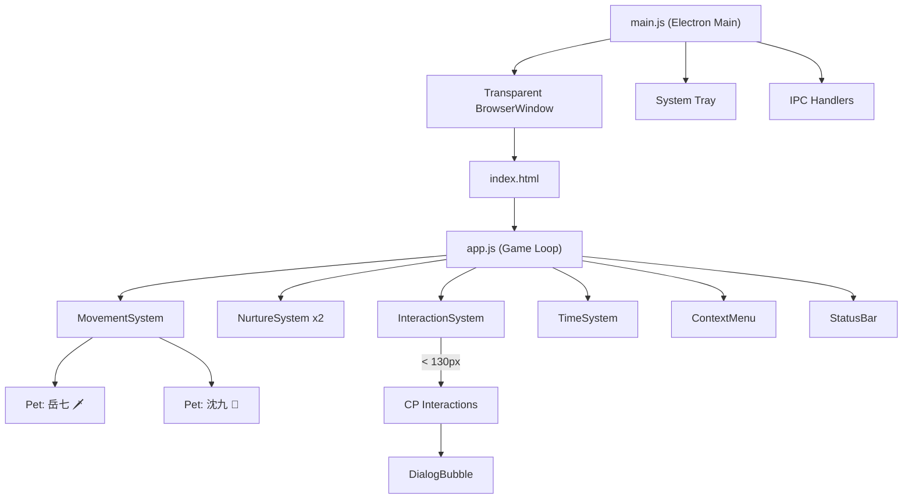

# DeskPet — 岳七 & 沈九 修仙桌宠 Walkthrough

## What Was Built

A complete desktop pet application featuring **岳清源（岳七）** and **沈清秋（沈九）** from 《人渣反派自救系统》. Two characters walk randomly on screen, and when they approach each other, they trigger CP-specific interactions with themed dialogue.

## Project Location

```
<repo-root>\
```

## How to Run

```bash
cd <repo-root>
npm run dev
```

## Architecture



## Key Features

### 1. Transparent Click-Through Window
- Full-screen transparent Electron window with `setIgnoreMouseEvents`
- Mouse events pass through to desktop by default
- Only pet elements intercept mouse events (via `mouseenter`/`mouseleave`)

### 2. Dual Character System
| Character | ID | Emoji | Color |
|---|---|---|---|
| 岳清源（岳七） | yueqi | 🗡️ | Jade green gradient |
| 沈清秋（沈九） | shenjiu | 🪭 | Purple gradient |

### 3. Random Walking
- Each pet picks random screen coordinates as targets
- Smooth per-frame movement via `requestAnimationFrame`
- Idle 3-8 seconds between walks
- CSS bounce animation while walking
- Direction-aware (faces left/right based on movement)

### 4. Xianxia Nurture System
| Stat | Decay Rate | Description |
|---|---|---|
| ❤️ 好感 | None (interaction only) | CP affection level |
| 🍖 饱腹 | -2 / 5 min | Hunger level |
| ✨ 灵力 | -1 / 5 min | Spiritual energy |
| 🧘 心境 | -1 / 5 min | Mental state, affected by other stats |

### 5. Player Actions (Right-Click Menu)
| Action | Effect |
|---|---|
| 🍎 喂食 | hunger +25, mood +5 |
| 🧘 打坐修炼 | qi slowly recovers over 30s |
| 🤚 摸头 (left click) | affection +3, mood +5 |
| 💤 休息 | qi +30, hunger -10 (辟谷) |

### 6. CP Interaction System
When the two pets walk within 130px of each other:

| Interaction | Weight | Requirement | Dialogue |
|---|---|---|---|
| 打招呼 | 30% | — | Character-specific greetings |
| 分食物 | 20% | — | 岳七 shares food with 沈九 |
| 一起修炼 | 25% | affection > 20 | Joint cultivation |
| 亲亲 | 15% | affection > 50 | Kiss (with 沈九 blushing) |
| 拥抱 | 10% | affection > 70 | Hug |

60-second cooldown between interactions.

### 7. Themed Dialogues
- Character-specific dialogue pools for each interaction type
- Idle chatter when alone ("小九在哪里呢…" / "（翻书）")
- Low-stat warnings ("灵力快见底了。" / "…肚子叫了。")

### 8. State Persistence
- Auto-saves every 60 seconds via `electron-store`
- Calculates offline decay on next launch
- Welcome-back messages: "你走了X个时辰…"

## Files Created

| File | Purpose |
|---|---|
| [main.js](../../main.js) | Electron main process |
| [preload.js](../../preload.js) | IPC bridge |
| [src/index.html](../../src/index.html) | Entry HTML |
| [src/index.css](../../src/index.css) | Xianxia-themed styles |
| [src/app.js](../../src/app.js) | Game loop |
| [src/data/config.js](../../src/data/config.js) | All tunable constants |
| [src/data/dialogues.js](../../src/data/dialogues.js) | Themed dialogue pools |
| [src/pet/Pet.js](../../src/pet/Pet.js) | Pet class |
| [src/pet/PetRenderer.js](../../src/pet/PetRenderer.js) | DOM rendering |
| [src/pet/SpriteView.js](../../src/pet/SpriteView.js) | Sprite rendering |
| [src/systems/MovementSystem.js](../../src/systems/MovementSystem.js) | Random walking |
| [src/systems/NurtureSystem.js](../../src/systems/NurtureSystem.js) | Stat management |
| [src/systems/InteractionSystem.js](../../src/systems/InteractionSystem.js) | CP interactions |
| [src/systems/TimeSystem.js](../../src/systems/TimeSystem.js) | Save/load/offline |
| [src/ui/ContextMenu.js](../../src/ui/ContextMenu.js) | Right-click menu |
| [src/ui/StatusBar.js](../../src/ui/StatusBar.js) | Stat display panel |
| [src/ui/DialogBubble.js](../../src/ui/DialogBubble.js) | Speech bubbles |

## Next Steps

1. **Visual verification** — run `npm run dev` and check that:
   - Two emoji characters appear on screen and walk around
   - Right-click on a character shows the menu
   - Left-click gives head pats
   - When they walk close, interaction dialogue appears
   - Desktop icons are clickable through the transparent window
2. **Art assets** — replace emoji with actual character sprites or Live2D models
3. **Tauri migration** — swap Electron for Tauri when ready for a lighter footprint
