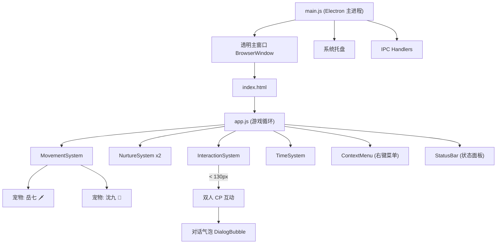

# DeskPet — 岳七 & 沈九 修仙桌宠功能指南 (Walkthrough)

## 项目简介

一个完整的桌面宠物程序，以《人渣反派自救系统》中的角色 **岳清源（岳七）** 和 **沈清秋（沈九）** 为原型。两个角色在屏幕上随机走动，当距离拉近时，会触发特定情境的双人 CP 互动和修仙主题对话。

## 项目位置

```
<repo-root>\
```

## 运行方式

```bash
cd <repo-root>
npm run dev
```

## 架构



## 核心功能

### 1. 透明点击穿透窗口
- 使用全屏透明的 Electron 窗口，配合 `setIgnoreMouseEvents`。
- 默认情况下鼠标事件可穿透至桌面（点击穿透）。
- 仅在鼠标移入宠物角色元素时拦截事件（通过 `mouseenter`/`mouseleave` 切换）。

### 2. 双角色系统
| 角色 | ID | Emoji (初代占位) | 代表色 |
|---|---|---|---|
| 岳清源（岳七） | yueqi | 🗡️ | 翡翠绿渐变 |
| 沈清秋（沈九） | shenjiu | 🪭 | 丁香紫渐变 |

### 3. 随机游走
- 宠物在屏幕上随机选取目标坐标进行行走。
- 借由 `requestAnimationFrame` 驱动流畅的每帧坐标更新。
- 行走间歇进行 3-8 秒的随机发呆/停顿（Idle）。
- 行走时具有 CSS 规律弹跳效果。
- 具备朝向感应（根据移动方向自动朝向左或右）。

### 4. 修仙风养成系统
| 数值 | 衰减速率 | 描述说明 |
|---|---|---|
| ❤️ 好感 | 无（仅通过互动回复） | 双人好感度级别 |
| 🍖 饱腹 | -2 / 5 分钟 | 饥饿程度 |
| ✨ 灵力 | -1 / 5 分钟 | 灵气储量 |
| 🧘 心境 | -1 / 5 分钟 | 状态优劣（饱腹、灵力太低时会连带受损） |

### 5. 互动操作（右键菜单）
| 操作项目 | 效果数值 |
|---|---|
| 🍎 喂食 | 饱腹值 +25，心境 +5 |
| 🧘 打坐修炼 | 灵力值在 30 秒内缓慢回复 |
| 🤚 摸头 (左键点击角色) | 好感度 +3，心境 +5 |
| 💤 休息 | 灵力值 +30，饱腹值 -10（模拟辟谷） |

### 6. 双人 CP 互动系统
当两位宠物角色之间的距离小于 130px 时：

| 互动类型 | 加权比重 | 解锁门槛 | 对话剧本示例 |
|---|---|---|---|
| 打招呼 | 30% | 无 | 专属日常问候 |
| 分食物 | 20% | 无 | 岳七将随身食物分给沈九 |
| 一起修炼 | 25% | 好感 > 20 | 共同闭关打坐 |
| 亲亲 | 15% | 好感 > 50 | 亲吻（伴随沈九傲娇脸红） |
| 拥抱 | 10% | 好感 > 70 | 怀抱相依 |

每次触发互动后，进入 60 秒的全局冷却时间（Cooldown）。

### 7. 专属对话文本
- 为不同的互动情境配备了角色性格相符 of 文本池。
- 单人闲逛时的独白语（如“小九在哪里呢…”或“（翻看书卷）”）。
- 数值过低时的警示信息（如“灵力快见底了。”或“…肚子叫了。”）。

### 8. 状态持久化
- 每隔 60 秒通过 `electron-store` 自动存档。
- 重启应用时，自动计算离线期间的值衰减。
- 上线欢迎对白：“你已离开 X 个时辰…”

## 创建的文件

| 文件路径 | 职责说明 |
|---|---|
| [main.js](../../main.js) | Electron 主进程入口 |
| [preload.js](../../preload.js) | 安全 IPC 桥接桥梁 |
| [src/index.html](../../src/index.html) | 前端入口 HTML |
| [src/index.css](../../src/index.css) | 仙侠风格的主体样式 |
| [src/app.js](../../src/app.js) | 核心游戏主循环 |
| [src/data/config.js](../../src/data/config.js) | 全局常量与数值配置 |
| [src/data/dialogues.js](../../src/data/dialogues.js) | 多语言/多情境对话池 |
| [src/pet/Pet.js](../../src/pet/Pet.js) | 宠物逻辑实体类 |
| [src/pet/PetRenderer.js](../../src/pet/PetRenderer.js) | DOM 管理与坐标控制 |
| [src/pet/SpriteView.js](../../src/pet/SpriteView.js) | 雪碧图动画帧管理 |
| [src/systems/MovementSystem.js](../../src/systems/MovementSystem.js) | 行走及碰撞边界逻辑 |
| [src/systems/NurtureSystem.js](../../src/systems/NurtureSystem.js) | 养成属性管理系统 |
| [src/systems/InteractionSystem.js](../../src/systems/InteractionSystem.js) | 触发碰撞与互动检测系统 |
| [src/systems/TimeSystem.js](../../src/systems/TimeSystem.js) | 时间差计算与自动存档系统 |
| [src/ui/ContextMenu.js](../../src/ui/ContextMenu.js) | 自定义右键快捷菜单 |
| [src/ui/StatusBar.js](../../src/ui/StatusBar.js) | 状态数值属性面板 |
| [src/ui/DialogBubble.js](../../src/ui/DialogBubble.js) | 头顶对话框展示组件 |

## 后续规划建议

1. **视觉验证**：运行 `npm run dev` 确保：
   - 两个宠物角色出现在屏幕上并能随机游走。
   - 右键点击显示动作菜单，左键点击显示摸头反馈。
   - 接近时正常触发双人对话和动画。
   - 桌面的其他图标与应用在透明区域下能正常穿透点击。
2. **艺术素材更新**：将占位符换成真正的角色雪碧图（Sprite Sheet）或 Live2D 精细立绘。
3. **框架迁移**：后续如有轻量化打包需求，可考虑将 Electron 移植为 Tauri（Rust 驱动）。
