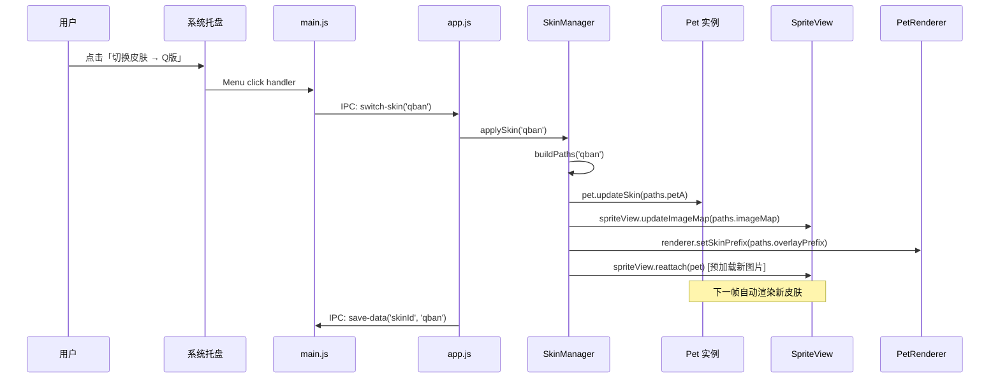
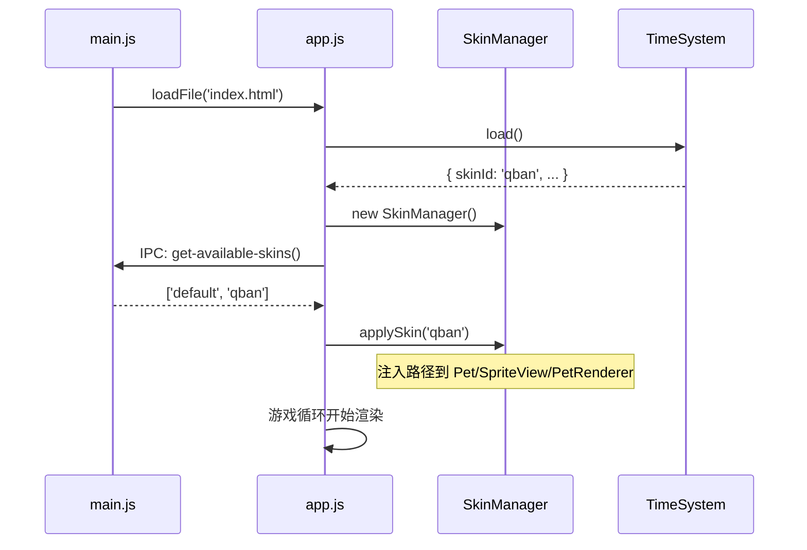

# 🎨 皮肤切换系统实施计划 (Skin System Plan)

> 本计划综合运用 **idea-refine**（构思精炼）、**spec-driven-development**（规格驱动开发）与 **planning-and-task-breakdown**（任务分解）三个方法论编写。

---

## 一、问题定义 (Problem Statement)

**How Might We** 在不改变游戏逻辑的前提下，让用户能够自由切换岳七和沈九的视觉皮肤（全套图片资源替换），使桌宠拥有更高的个性化和复玩价值？

### 当前痛点
- 所有图片资源**硬编码**散落在 `src/assets/` 根目录下，无法区分"皮肤集"
- `config.js`、`SpriteView.js`、`PetRenderer.js` 中的图片路径全部写死，无动态替换机制
- 用户想要另一套风格的图（如 Q版、现代装、校园风）时，需要**手动替换文件并改代码**

### 目标用户
- 桌宠的终端用户（想一键切换皮肤）
- 未来的美术协作者（只需往文件夹里放图，不用碰代码）

### 成功标准
1. 用户可以通过**托盘菜单**一键切换已安装的皮肤
2. 一个文件夹 = 一套皮肤，美术只需按约定命名放图，**零代码**
3. 切换皮肤后立即生效，无需重启应用
4. 皮肤选择在下次启动时**自动恢复**

---

## 二、构思精炼 (Idea Refinement)

### 2.1 方案对比

| 方案 | 描述 | 优点 | 缺点 |
|------|------|------|------|
| **A. 文件夹约定** ✅ | `assets/{skinId}/` 下按固定命名放图 | 零配置、美术友好、实现简单 | 皮肤内容必须完整 |
| B. manifest.json | 每个皮肤文件夹带 JSON 元数据 | 灵活、可配置 | 增加复杂度，美术需写 JSON |
| C. 热加载 + 主题包 | 打包为 .zip 并支持导入 | 支持社区分发 | V1 过度设计 |

**选定方案 A**：文件夹约定制，最简可行，V1 不做 JSON/ZIP。

### 2.2 关键假设

- [x] 假设 1：所有皮肤共享相同的**文件名约定**（已被 `skin_assets_requirements.csv` 验证）
- [x] 假设 2：用户不需要对单个角色独立换皮（V1 整套换）
- [x] 假设 3：互动叠加层图片（`kiss.png`, `hug.png` 等）也属于皮肤的一部分

### 2.3 Not Doing（V1 不做）

| 功能 | 原因 |
|------|------|
| 皮肤商店/在线下载 | 超出 MVP 范围，且需要后端 |
| 单角色独立换皮 | 增加 UX 复杂度，CP 主题统一更好 |
| 皮肤预览缩略图 | 可以后续迭代，V1 直接切换 |
| 自定义皮肤创建向导 | 美术直接按 CSV 文档放文件即可 |
| 皮肤动画帧数量差异化 | V1 要求所有皮肤帧数一致（4帧） |

---

## 三、规格定义 (Specification)

### 3.1 assets 目录结构约定

```
src/assets/
├── default/                    # 默认皮肤（即当前所有图片）
│   ├── left.png                # 岳七 idle
│   ├── right.png               # 沈九 idle
│   ├── left_eat.png            # 岳七 进食
│   ├── left_sleep.png          # 岳七 睡眠
│   ├── left_cultivate.png      # 岳七 打坐
│   ├── left_hungry.png         # 岳七 饥饿
│   ├── left_pat.png            # 岳七 被撒娇
│   ├── right_eat.png           # 沈九 进食
│   ├── right_sleep.png         # 沈九 睡眠
│   ├── right_cultivate.png     # 沈九 打坐
│   ├── right_hungry.png        # 沈九 饥饿
│   ├── right_pat.png           # 沈九 被撒娇
│   ├── shareFood.png           # 互动：分享食物
│   ├── cultivate.png           # 互动：双修
│   ├── kiss.png                # 互动：亲吻
│   ├── hug.png                 # 互动：拥抱
│   ├── yueqi/                  # 岳七行走帧
│   │   ├── walk_left01~04.png
│   │   └── walk_right01~04.png
│   └── shenjiu/                # 沈九行走帧
│       ├── walk_left01~04.png
│       └── walk_right01~04.png
├── qban/                       # Q版皮肤（示例）
│   ├── (same structure as default)
│   └── ...
└── icon.ico                    # 应用图标（不随皮肤变化）
    icon.png
```

> **核心约定**：`src/assets/` 下**每个子目录**（除 `icon.ico`、`icon.png`）即为一套皮肤。皮肤 ID = 目录名。

### 3.2 SkinManager 模块规格

新增 `src/systems/SkinManager.js`，作为皮肤管理的单一入口：

**皮肤名称映射表** — 文件夹用英文/数字命名，托盘菜单显示中文名：

```javascript
// 在 SkinManager 中维护，或放在 config.js 中
const SKIN_NAMES = {
  'default': '默认·仙侠水墨',
  'qban':    'Q版·萌系',
  // 新增皮肤时在此添加映射
};
```

> 若某个皮肤文件夹 ID 不在 `SKIN_NAMES` 中，则托盘菜单直接显示文件夹名（兜底）。

```javascript
/**
 * SkinManager — 管理和切换桌宠皮肤的系统。
 * 
 * 职责：
 * 1. 扫描 assets 目录获取可用皮肤列表
 * 2. 根据选中皮肤生成完整的路径映射
 * 3. 将路径注入 config、SpriteView、PetRenderer
 * 4. 持久化用户的皮肤选择
 */
class SkinManager {
  constructor() {
    this.currentSkinId = 'default';
    this.availableSkins = [];     // ['default', 'qban', ...]
  }

  // 返回可用皮肤列表 [{id, displayName}]
  getAvailableSkins(): {id: string, displayName: string}[]

  // 获取当前皮肤 ID
  getCurrentSkin(): string

  // 获取皮肤的中文显示名（优先查 SKIN_NAMES，兜底用文件夹名）
  getDisplayName(skinId: string): string

  // 切换皮肤，返回新的路径映射。内部支持单文件缺失时 Fallback 到 default
  applySkin(skinId: string): SkinPaths

  // 基于 skinId 构建全套路径映射
  buildPaths(skinId: string): SkinPaths
}
```

**SkinPaths 数据结构**：

```javascript
{
  petA: {
    image: 'assets/{skinId}/left.png',
    sprites: {
      idle: { frames: ['assets/{skinId}/left.png'], fps: 1 },
      walkingLeft: { frames: ['assets/{skinId}/yueqi/walk_left01.png', ...], fps: 4 },
      walkingRight: { frames: ['assets/{skinId}/yueqi/walk_right01.png', ...], fps: 4 },
    }
  },
  petB: {
    image: 'assets/{skinId}/right.png',
    sprites: { /* 同上结构 */ }
  },
  imageMap: {
    shenjiu: {
      meditating: 'assets/{skinId}/right_cultivate.png',
      hungry: 'assets/{skinId}/right_hungry.png',
      // ...
    },
    yueqi: {
      meditating: 'assets/{skinId}/left_cultivate.png',
      // ...
    }
  },
  overlayPrefix: 'assets/{skinId}/'  // PetRenderer.showOverlay 使用
}
```

### 3.3 需修改的文件及改动描述

#### 层 1：数据层

| 文件 | 改动类型 | 描述 |
|------|----------|------|
| `src/data/config.js` | MODIFY | 将 `PET_A.image`、`PET_A.sprites`、`PET_B.image`、`PET_B.sprites` 中的硬编码 `assets/xxx` 路径改为**动态注入**。初始值仍然指向 `assets/default/xxx`，但会被 `SkinManager.applySkin()` 在运行时覆盖。 |

#### 层 2：皮肤管理器（新增）

| 文件 | 改动类型 | 描述 |
|------|----------|------|
| `src/systems/SkinManager.js` | **NEW** | 新增皮肤管理系统。负责：扫描可用皮肤、构建路径映射、将映射注入到 Pet 实例和 SpriteView。 |

#### 层 3：渲染层（路径参数化）

| 文件 | 改动类型 | 描述 |
|------|----------|------|
| `src/pet/SpriteView.js` | MODIFY | `imageMap` 不再硬编码，改为构造函数接收或通过 `updateImageMap(newMap)` 方法动态更新。切换皮肤时需重新预加载图片。 |
| `src/pet/PetRenderer.js` | MODIFY | `showOverlay()` 中的 `` `assets/${type}.png` `` 路径改为从当前皮肤路径前缀中读取。 |
| `src/pet/Pet.js` | MODIFY | 新增 `updateSkin(skinPaths)` 方法，用于运行时更新 `this.image` 和 `this.sprites`。 |

#### 层 4：应用主控 & 入口

| 文件 | 改动类型 | 描述 |
|------|----------|------|
| `src/app.js` | MODIFY | 初始化 `SkinManager`，加载保存的皮肤偏好，应用初始皮肤。监听来自主进程的皮肤切换 IPC 消息。 |
| `src/index.html` | MODIFY | 新增 `<script src="systems/SkinManager.js">` 引入。 |

#### 层 5：Electron 主进程 & IPC

| 文件 | 改动类型 | 描述 |
|------|----------|------|
| `main.js` | MODIFY | 在托盘菜单中新增「🎨 切换皮肤」子菜单，列出可用皮肤。点击后通过 IPC 通知渲染进程切换。新增 IPC handler 用于扫描 `src/assets/` 下的子目录。 |
| `preload.js` | MODIFY | 暴露皮肤相关的 IPC 方法：`getAvailableSkins()`、`onSwitchSkin(callback)`。 |

#### 层 6：资源文件迁移

| 操作 | 描述 |
|------|------|
| 将 `src/assets/*.png` 移入 `src/assets/default/` | 除 `icon.ico` 和 `icon.png` 外的所有图片 |
| 将 `src/assets/yueqi/` 移入 `src/assets/default/yueqi/` | 岳七行走帧 |
| 将 `src/assets/shenjiu/` 移入 `src/assets/default/shenjiu/` | 沈九行走帧 |

#### 层 7：持久化

| 文件 | 改动类型 | 描述 |
|------|----------|------|
| `src/systems/TimeSystem.js` | MODIFY | `save()` / `load()` 增加 `skinId` 字段，持久化用户选择的皮肤。 |

### 3.4 数据流图



### 3.5 启动时序



---

## 四、任务分解 (Task Breakdown)

### Phase 0：资源文件迁移 ⏱️ ~15 min
- [x] 0.1 在 `src/assets/` 下创建 `default/` 文件夹
- [x] 0.2 将所有 `.png` 文件（除 `icon.ico`、`icon.png`）移入 `default/`
- [x] 0.3 将 `src/assets/yueqi/` 移入 `src/assets/default/yueqi/`
- [x] 0.4 将 `src/assets/shenjiu/` 移入 `src/assets/default/shenjiu/`
- [x] 0.5 全局搜索并更新所有 `'assets/xxx'` 路径为 `'assets/default/xxx'`
- [x] 0.6 验证：启动应用，确认所有图片正常显示

### Phase 1：SkinManager 核心实现 ⏱️ ~30 min
- [x] 1.1 新建 `src/systems/SkinManager.js`
  - 实现 `buildPaths(skinId)` 方法
  - 实现 `applySkin(skinId)` 方法
  - 实现 `getCurrentSkin()` / `getAvailableSkins()` 方法
- [x] 1.2 在 `Pet.js` 中新增 `updateSkin(skinPaths)` 方法
- [x] 1.3 在 `SpriteView.js` 中新增 `updateImageMap(newMap)` 方法和 `reattach(pet)` 方法
- [x] 1.4 在 `PetRenderer.js` 中新增 `setSkinPrefix(prefix)` 并参数化 `showOverlay()`

### Phase 2：主进程集成 ⏱️ ~20 min
- [x] 2.1 `main.js`：新增 IPC handler `get-available-skins`（扫描 `src/assets/`，使用 `fs.statSync` 过滤出仅包含文件夹的列表，排除非目录文件）
- [x] 2.2 `main.js`：在托盘菜单 `buildTrayMenu()` 中加入「🎨 切换皮肤」子菜单（使用 `SKIN_NAMES` 映射显示中文名）
- [x] 2.3 `main.js`：点击菜单项时发送 IPC `switch-skin` 消息
- [x] 2.4 `preload.js`：暴露 `getAvailableSkins()` 和 `onSwitchSkin(callback)`

### Phase 3：渲染进程集成 ⏱️ ~20 min
- [x] 3.1 `src/index.html`：新增 `SkinManager.js` script 标签
- [x] 3.2 `app.js`：初始化 SkinManager
- [x] 3.3 `app.js`：启动时从 TimeSystem 加载保存的 skinId 并应用
- [x] 3.4 `app.js`：监听 `onSwitchSkin` IPC 消息，调用 `skinManager.applySkin()`，并**异步等待**图片预加载完成后再应用新渲染，防止画面闪烁

### Phase 4：持久化 ⏱️ ~10 min
- [x] 4.1 `TimeSystem.js`：`save()` 增加 `skinId` 字段
- [x] 4.2 `TimeSystem.js`：`load()` 读取 `skinId` 并返回
- [x] 4.3 `app.js`：切换皮肤时自动保存偏好

### Phase 5：测试与验证 ⏱️ ~15 min
- [ ] 5.1 创建一个测试皮肤文件夹（可以用 default 的副本）
- [x] 5.2 启动应用，测试托盘菜单皮肤列表是否正确（自动化覆盖：托盘扫描、IPC 暴露、渲染进程接线）
- [ ] 5.3 切换皮肤，验证所有视觉状态（idle、walking、eating、sleeping、meditating、hungry、patted）
- [ ] 5.4 切换皮肤后触发 CP 互动，验证叠加层图片正确
- [x] 5.5 退出并重启应用，验证皮肤选择被持久化（自动化覆盖：`TimeSystem.save/load` 的 `skinId` 存取与旧存档兼容）
- [x] 5.6 更新 `config.js` 中的默认路径指向 `assets/default/`
- [x] 5.7 回归测试：确认 default 皮肤下所有功能正常（自动化覆盖：default 资源完整性与全量 `npm test`）

### Phase 6：文档与发布 ⏱️ ~10 min
- [x] 6.1 更新 `docs/structure.md` 添加 SkinManager 描述
- [x] 6.2 更新 `docs/skin_assets_requirements.csv` 说明文件夹约定
- [x] 6.3 更新 `CHANGELOG.md`
- [x] 6.4 提交代码

---

## 五、风险与缓解

| 风险 | 影响 | 缓解措施 |
|------|------|----------|
| 皮肤文件夹缺少某些图片 | 白屏/报错 | `SkinManager.buildPaths()` 中做文件完整性检查，缺失单个图片时自动 fallback 到 default 对应图片 |
| 打包后路径变化 | 找不到图片 | 统一使用相对于 `index.html` 的相对路径，Electron 打包后 `src/` 结构保持不变 |
| 行走帧数量不同 | 动画跳帧 | V1 约定所有皮肤统一 4 帧，在 CSV 中明确说明 |
| 切换皮肤时的闪烁 | 视觉体验差 | `SpriteView` 采用异步 `Promise` 预加载所有新皮肤图片，等待 `onload` 触发完成后再无缝切换 |

---

## 六、已确认的决策 (Resolved Decisions)

| # | 问题 | 决策 |
|---|------|------|
| 1 | **皮肤中文显示名** | 文件夹用英文/数字命名，另配 `SKIN_NAMES` 映射表在托盘菜单中显示中文名 |
| 2 | **旧版存档兼容** | 无 `skinId` 字段时默认回退到 `'default'` |
| 3 | **icon.ico 是否跟随皮肤** | V1 不做，图标保持不变 |

---

*估计总工时：~2 小时*
*优先级：Medium — 功能性增强，不阻塞核心体验*
