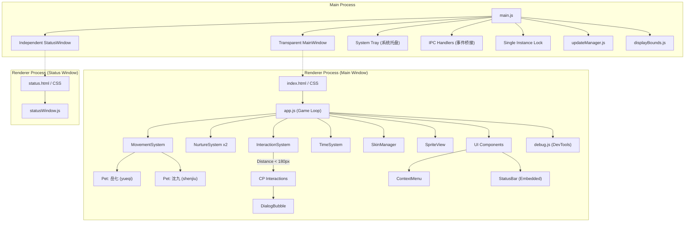

# DeskPet 系统架构与代码结构 (System Architecture)

本文档基于 `documentation-and-adrs` 规范编写，旨在为未来的开发维护（包括人类与 AI Agent）提供当前 DeskPet 项目的全局架构概览。

## 1. 核心架构图 (High-Level Architecture)

整个应用采用 **Electron** 框架构建，分为主进程（Main Process）和渲染进程（Renderer Process）。核心逻辑（宠物移动、数值养成、状态机）完全在前端渲染进程中以**游戏循环**（Game Loop）的方式驱动。



## 2. 目录结构 (Project Structure)

```text
qijiu-desktop-pet\
├── main.js                  # Electron 主进程入口 (单实例锁、创建窗口、托盘、处理 IPC)
├── updateManager.js         # 更新检查与下载确认逻辑 (GitHub Releases / electron-updater)
├── displayBounds.js         # 多显示器坐标转换与可行走区域计算 (Pure Logic)
├── preload.js               # IPC 桥接 (暴露 window.electronAPI)
├── src/
│   ├── index.html           # 渲染进程入口，挂载 UI 与引入脚本
│   ├── index.css            # 仙侠风样式、布局、基础动画
│   ├── app.js               # 核心主控逻辑：初始化系统、启动 requestAnimationFrame 游戏循环
│   ├── debug.js             # 开发调试工具 (提供 testKiss() 等 Console 函数)
│   ├── status.html          # 独立数值状态窗口 HTML
│   ├── status.css           # 独立数值状态窗口样式
│   ├── statusWindow.js      # 独立数值状态窗口逻辑
│   ├── status.css           # 独立数值状态窗口样式
│   ├── data/
│   │   ├── config.js        # 所有的全局配置（数值衰减、移动速度、互动权重与距离等）
│   │   └── dialogues.js     # 互动与闲聊的台词池
│   ├── pet/
│   │   ├── Pet.js           # 宠物实体类（状态机、位置、四维数值）
│   │   ├── PetRenderer.js   # 负责生成 DOM 并实时更新坐标，处理视觉缩放与拖曳
│   │   └── SpriteView.js    # 负责基于状态的雪碧图动画帧播放、预加载与 DOM 复用
│   ├── systems/             # 独立的业务逻辑子系统
│   │   ├── InteractionSystem.js # 负责检测距离并触发两人的 CP 互动
│   │   ├── MovementSystem.js    # 负责计算随机走动目标点与步进，处理状态切换时序
│   │   ├── NurtureSystem.js     # 负责数值衰减、回复及喂食/修炼等操作
│   │   ├── SkinManager.js       # 负责皮肤列表、路径映射、运行时切换和渲染注入
│   │   └── TimeSystem.js        # 负责离线时间计算和自动存档 (electron-store)
│   ├── assets/
│   │   ├── default/         # 默认皮肤；每个子目录代表一套完整皮肤
│   │   ├── icon.ico         # 应用图标，不随皮肤切换
│   │   └── icon.png         # 应用图标，不随皮肤切换
│   └── ui/                  # 独立 UI 组件
│       ├── ContextMenu.js   # 右键交互菜单 (支持跟随显示器缩放)
│       ├── DialogBubble.js  # 头顶对话气泡
│       └── StatusBar.js     # 数值状态面板 (嵌入式)
├── test/                    # 单元测试 (Mocha/Chai)，验证移动逻辑与坐标转换
└── docs/
    ├── structure.md         # 当前架构、核心机制与目录说明
    ├── git-workflow.md      # Git 提交、推送与变更记录规范
    ├── release-workflow.md  # Windows 安装包发布流程
    ├── decisions/           # 架构决策记录 (ADRs)
    ├── plan/                # 尚未完成或仍需验证的计划文档
    ├── skin_assets_requirements.csv  # 皮肤资源命名与路径约定
    └── ...
```

## 3. 核心机制 (Core Mechanisms)

### 3.1 游戏循环 (Game Loop)
所有的视觉更新与状态计算均在 `app.js` 的 `gameLoop` 中执行。
- **保护机制**: 由 `try/catch` 完整包裹，防止某一步骤的局部错误（例如未定义的字典访问）导致整个 `requestAnimationFrame` 链条断裂（详见 [ADR-005](./decisions/ADR-005-gameloop-crash-protection.md)）。
- **休眠唤醒处理**: 针对系统睡眠导致 `requestAnimationFrame` 挂起的场景，系统会自动检测大于 60s 的时间跳跃（deltaMs），并将其视为“离线时间”进行即时结算，同时触发欢迎对白并对该帧 deltaMs 进行压制，以防止物理系统崩溃（详见 [ADR-019](./decisions/ADR-019-handling-time-jumps-after-system-sleep.md)）。
- **状态切换时序**: 在从 `idle` 切换到 `walking` 的当帧立即确定朝向，确保首个渲染帧方向正确，消除“闪眼睛”现象（详见 [ADR-023](./decisions/ADR-023-stabilize-sprite-frame-transition.md)）。
- **更新顺序**: Movement (移动) -> Nurture (数值衰减) -> Interaction (碰撞与互动检测) -> Rendering (DOM 坐标更新) -> SpriteView (动画帧更新)。

### 3.2 鼠标穿透策略 (Click-Through)
由于窗口是全屏透明的，必须精心管理鼠标事件以保证不影响用户正常使用电脑。
- **默认状态**: `setIgnoreMouseEvents(true, { forward: true })`（允许点击穿透到桌面，但保留鼠标移动监听）。
- **交互状态**: 当鼠标移入宠物 (`PetRenderer`)、菜单 (`ContextMenu`) 或面板 (`StatusBar`) 时，触发 `mouseenter` 并调用 `setIgnoreMouseEvents(false)` 解除穿透。
- **恢复穿透**: 在 `mouseleave` 发生时，系统会检查是否有菜单面板处于打开状态，若无，则重新开启点击穿透（详见 [ADR-002](./decisions/ADR-002-mouse-clickthrough-strategy.md)）。

### 3.3 拖曳系统 (Drag & Drop)
为了保证拖曳的流畅且不会在拖动过快时丢失事件，拖曳链并非全挂在宠物元素上。
- **触发**: 在宠物身上触发 `mousedown`，标记 `isDragging = true`。
- **跟踪**: 在全局 `document` 上监听 `mousemove` 和 `mouseup`。
- **互斥**: 拖曳期间，`InteractionSystem` 会忽略碰撞检测，防止未放手时触发互动进入冷却；`MovementSystem` 也会暂停移动计算（详见 [ADR-004](./decisions/ADR-004-drag-implementation.md)）。

### 3.4 互动系统 (Interaction System)
桌面宠物的核心卖点是双人 CP 互动。
- `InteractionSystem` 每帧检查两人的直线距离（目前设定为 `< 180px`）。
- 满足距离后，系统会计算两人的 **平均好感度**，以好感度为门槛解锁 `CONFIG.INTERACTIONS` 中的选项。
- **动态朝向**: 互动触发时，两人会自动调整朝向，使彼此正对（沈九面向右，岳七面向左）。
- **资源约定**: 互动覆盖图（Overlay）中，**沈九固定位于左侧**，岳七位于右侧，且坐标与单人行走帧对齐。
- 采用 **加权随机算法** 选取最终的互动动作，执行后进入全局冷却（目前为 20s）。

### 3.5 状态持久化 (Persistence)
- 依赖主进程的 `electron-store`。
- `TimeSystem` 每分钟自动执行一次保存。
- 启动时，计算当前时间与上次保存时间的差值，调用 `NurtureSystem.applyOfflineDecay()` 批量扣除离线期间的数值（饱腹、灵力、心境）。
- 存档同时记录 `skinId`。旧存档没有该字段时自动回退到 `default`，保证升级兼容。

### 3.6 皮肤切换系统 (Skin System)
皮肤系统采用“一个文件夹 = 一套皮肤”的约定，避免为每套皮肤维护额外配置文件。
- **资源约定**: `src/assets/{skinId}/` 下按固定命名放置单人状态图、行走帧和双人互动覆盖图；`icon.ico` / `icon.png` 保持在 `src/assets/` 根目录，不随皮肤变化。
- **主进程**: `main.js` 扫描 `src/assets/` 下的子目录生成托盘「切换皮肤」菜单，并通过 `switch-skin` IPC 通知渲染进程。
- **渲染进程**: `app.js` 初始化 `SkinManager`，启动时应用存档里的 `skinId`，切换时调用 `SkinManager.applySkin()`。
- **渲染注入**: `SkinManager` 将路径映射注入 `Pet.updateSkin()`、`SpriteView.updateImageMap()` 和 `PetRenderer.setSkinPrefix()`。
- **稳定性**: `SpriteView` 在切换皮肤或初始化时会**预加载**所有相关的 `Image` 对象并保持引用，同时复用 `` DOM 节点仅更新 `src`，以消除资源加载时的白闪（详见 [ADR-023](./decisions/ADR-023-stabilize-sprite-frame-transition.md)）。
- **持久化**: 切换成功后立即保存当前 `skinId`，自动保存和退出保存也会带上当前皮肤。

### 3.7 隐藏/显示机制 (Hide & Show System)
为了不干扰用户的正常工作空间，在系统托盘菜单中加入了"隐藏桌宠"功能。
- **主进程**: 维护 `petHidden` 状态，根据状态动态重建托盘菜单标签。
- **IPC 通信**: 切换状态时，主进程通过 `toggle-pet-visibility` 消息通知渲染进程。
- **渲染进程**: `app.js` 接收消息后，不仅通过 `display: none` 隐藏包含宠物的 `#pet-stage`，更重要的是**暂停游戏逻辑 (`isPaused = !visible`)**，避免在不可见状态下继续消耗数值和资源（详见 [ADR-011](./decisions/ADR-011-hide-show-pet-functionality.md)）。

### 3.8 单实例启动锁 (Single Instance)
桌宠在同一用户会话中只允许存在一个主进程实例。
- **启动早期加锁**: `main.js` 通过 `app.requestSingleInstanceLock()` 获取 Electron 单实例锁。
- **重复启动处理**: 第二次点击桌面快捷方式时，新进程立即退出，既有实例通过 `second-instance` 事件执行唤起逻辑。
- **唤起行为**: 既有窗口会恢复/显示、重新置顶，并将隐藏状态复位为可见，避免用户以为应用没有响应（详见 [ADR-021](./decisions/ADR-021-single-instance-launch-lock.md)）。

### 3.9 更新管理 (Update Manager)
`updateManager.js` 集中封装托盘菜单触发的手动更新检查。
- **入口**: 托盘菜单调用 `checkForUpdatesFromTray()`，仅打包版本执行真实更新检查。
- **发布源**: `electron-updater` 读取 GitHub Releases 中的 `latest.yml`、安装包和 `.blockmap`。
- **友好降级**: 当发布元数据缺失或返回 404 时，手动检查会按“已是最新版本”处理，避免把小范围发布或元数据未上传误报成严重错误。

### 3.10 多显示器支持 (Multi-Display Support)
应用支持在混合 DPI 的多显示器环境下无缝运行。
- **覆盖范围**: 主透明窗口覆盖完整的“虚拟桌面”边界。
- **坐标转换**: `displayBounds.js` 将每个物理显示器的 `workArea` 转换为相对于主窗口左上角的 CSS 相对坐标（`walkAreas`）。
- **视觉一致性**: 渲染层（`PetRenderer`、`ContextMenu`）根据元素当前所在的显示器，动态应用 `scaleRatio` (Display Scale / Window Scale)，确保小人与 UI 在不同缩放比例的屏幕上看起来物理大小一致（详见 [ADR-022](./decisions/ADR-022-multi-display-support-boundary.md)）。

### 3.11 调试与测试体系 (Debug & Test)
- **控制台调试**: `src/debug.js` 提供了 `testKiss()`、`testHungry()` 等函数，方便开发者在控制台手动触发各种互动状态和视觉效果。
- **运行时监控**: 暴露 `window.__DEBUG_SCREEN()` 供排查多屏边界问题。
- **单元测试**: `test/` 目录下包含对 `displayBounds.js` 和 `MovementSystem.js` 等纯逻辑模块的测试，确保坐标计算与状态切换的稳定性。

### 3.12 独立状态窗口 (Independent Status Window)
除了嵌入在宠物旁边的状态条外，应用还提供了一个独立的“详细状态面板”。
- **架构**: 这是一个独立的 `BrowserWindow` (`status.html`)，由主进程通过 IPC 管理其生命周期。
- **数据流**: 渲染进程定期通过 `update-status-window` IPC 将最新的数值同步给主进程，再由主进程转发给状态窗口。
- **自适应**: 状态窗口会根据内容高度动态调整自身窗口尺寸 (`resize-status-window`)。

## 4. 后续建议 (Next Steps)
1. **扩展动画资产与状态**: 当前已通过 `SpriteView.js` 引入了雪碧图（Sprite Sheet）渲染机制。后续可以继续丰富现有的动作帧（如增加更流畅的过渡动画），或为不同环境（如天气系统、皮肤系统）扩充更多图集资产和状态图。
2. **迁移与优化**: 如果未来 Electron 占用的内存（>100MB）让用户困扰，可以参考当前清晰的 `systems/` 与 `ui/` 分层，将前端逻辑完整平移到 **Tauri** (Rust) 框架中以降低包体积和内存占用。
