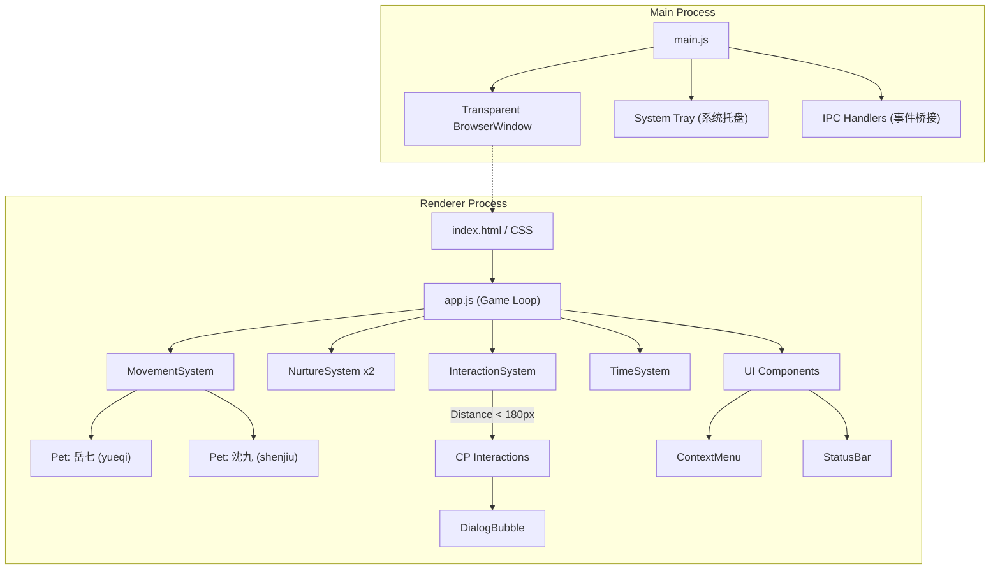

# DeskPet 系统架构与代码结构 (System Architecture)

本文档基于 `documentation-and-adrs` 规范编写，旨在为未来的开发维护（包括人类与 AI Agent）提供当前 DeskPet 项目的全局架构概览。

## 1. 核心架构图 (High-Level Architecture)

整个应用采用 **Electron** 框架构建，分为主进程（Main Process）和渲染进程（Renderer Process）。核心逻辑（宠物移动、数值养成、状态机）完全在前端渲染进程中以**游戏循环**（Game Loop）的方式驱动。



## 2. 目录结构 (Project Structure)

```text
C:\Users\alexa\desktop-pet\
├── main.js                  # Electron 主进程入口 (创建窗口、托盘、处理 IPC)
├── preload.js               # IPC 桥接 (暴露 window.electronAPI)
├── src/
│   ├── index.html           # 渲染进程入口，挂载 UI 与引入脚本
│   ├── index.css            # 仙侠风样式、布局、基础动画
│   ├── app.js               # 核心主控逻辑：初始化系统、启动 requestAnimationFrame 游戏循环
│   ├── data/
│   │   ├── config.js        # 所有的全局配置（数值衰减、移动速度、互动权重与距离等）
│   │   └── dialogues.js     # 互动与闲聊的台词池
│   ├── pet/
│   │   ├── Pet.js           # 宠物实体类（状态机、位置、四维数值）
│   │   ├── PetRenderer.js   # 负责生成 DOM 并实时更新坐标，处理鼠标事件和拖曳逻辑
│   │   └── PetAnimations.js # 处理站立/移动等动画表现
│   ├── systems/             # 独立的业务逻辑子系统
│   │   ├── InteractionSystem.js # 负责检测距离并触发两人的 CP 互动
│   │   ├── MovementSystem.js    # 负责计算随机走动目标点与步进
│   │   ├── NurtureSystem.js     # 负责数值衰减、回复及喂食/修炼等操作
│   │   └── TimeSystem.js        # 负责离线时间计算和自动存档 (electron-store)
│   └── ui/                  # 独立 UI 组件
│       ├── ContextMenu.js   # 右键交互菜单
│       ├── DialogBubble.js  # 头顶对话气泡
│       └── StatusBar.js     # 数值状态面板
└── docs/decisions/          # 架构决策记录 (ADRs)
```

## 3. 核心机制 (Core Mechanisms)

### 3.1 游戏循环 (Game Loop)
所有的视觉更新与状态计算均在 `app.js` 的 `gameLoop` 中执行。
- **保护机制**: 由 `try/catch` 完整包裹，防止某一步骤的局部错误（例如未定义的字典访问）导致整个 `requestAnimationFrame` 链条断裂（详见 [ADR-005](./decisions/ADR-005-gameloop-crash-protection.md)）。
- **休眠唤醒处理**: 针对系统睡眠导致 `requestAnimationFrame` 挂起的场景，系统会自动检测大于 60s 的时间跳跃（deltaMs），并将其视为“离线时间”进行即时结算，同时触发欢迎对白并对该帧 deltaMs 进行压制，以防止物理系统崩溃（详见 [ADR-019](./decisions/ADR-019-handling-time-jumps-after-system-sleep.md)）。
- **更新顺序**: Movement (移动) -> Nurture (数值衰减) -> Interaction (碰撞与互动检测) -> Rendering (视觉渲染)。

### 3.2 鼠标穿透策略 (Click-Through)
由于窗口是全屏透明的，必须精心管理鼠标事件以保证不影响用户正常使用电脑。
- **默认状态**: `setIgnoreMouseEvents(true, { forward: true })`（允许点击穿透到桌面，但保留鼠标移动监听）。
- **交互状态**: 当鼠标移入宠物 (`PetRenderer`)、菜单 (`ContextMenu`) 或面板 (`StatusBar`) 时，触发 `mouseenter` 并调用 `setIgnoreMouseEvents(false)` 解除穿透。
- **恢复穿透**: 在 `mouseleave` 发生时，系统会检查是否有菜单面板处于打开状态，若无，则重新开启点击穿透（详见 [ADR-002](./decisions/ADR-002-mouse-clickthrough-strategy.md)）。

### 3.3 拖曳系统 (Drag & Drop)
为了保证拖曳的流畅且不会在拖动过快时丢失事件，拖曳链并非全挂在宠物元素上。
- **触发**: 在宠物身上触发 `mousedown`，标记 `isDragging = true`。
- **跟踪**: 在全局 `document` 上监听 `mousemove` 和 `mouseup`。
- **互斥**: 拖曳期间，`InteractionSystem` 会忽略碰撞检测，防止未放手时触发互动进入冷却；`MovementSystem` 也会暂停移动计算（详见 [ADR-004](./decisions/ADR-004-drag-implementation.md)）。

### 3.4 互动系统 (Interaction System)
桌面宠物的核心卖点是双人 CP 互动。
- `InteractionSystem` 每帧检查两人的直线距离（目前设定为 `< 180px`）。
- 满足距离后，系统会计算两人的 **平均好感度**，以好感度为门槛解锁 `CONFIG.INTERACTIONS` 中的选项。
- 采用 **加权随机算法** 选取最终的互动动作，执行后进入全局冷却（目前为 20s）。

### 3.5 状态持久化 (Persistence)
- 依赖主进程的 `electron-store`。
- `TimeSystem` 每分钟自动执行一次保存。
- 启动时，计算当前时间与上次保存时间的差值，调用 `NurtureSystem.applyOfflineDecay()` 批量扣除离线期间的数值（饱腹、灵力、心境）。

### 3.6 隐藏/显示机制 (Hide & Show System)
为了不干扰用户的正常工作空间，在系统托盘菜单中加入了"隐藏桌宠"功能。
- **主进程**: 维护 `petHidden` 状态，根据状态动态重建托盘菜单标签。
- **IPC 通信**: 切换状态时，主进程通过 `toggle-pet-visibility` 消息通知渲染进程。
- **渲染进程**: `app.js` 接收消息后，不仅通过 `display: none` 隐藏包含宠物的 `#pet-stage`，更重要的是**暂停游戏逻辑 (`isPaused = !visible`)**，避免在不可见状态下继续消耗数值和资源（详见 [ADR-011](./decisions/ADR-011-hide-show-pet-functionality.md)）。

## 4. 后续建议 (Next Steps)
1. **扩展美术资产**: 当前已经初步引入了图片资产（`left.png`, `right.png`, 互动专用的 `kiss.png`）。后续可以继续丰富 `PetAnimations.js` 和 `PetRenderer.js`，引入更多的帧动画或完整的精灵图 (Sprite Sheets)，甚至是 Live2D 模型。
2. **迁移与优化**: 如果未来 Electron 占用的内存（>100MB）让用户困扰，可以参考当前清晰的 `systems/` 与 `ui/` 分层，将前端逻辑完整平移到 **Tauri** (Rust) 框架中以降低包体积和内存占用。
