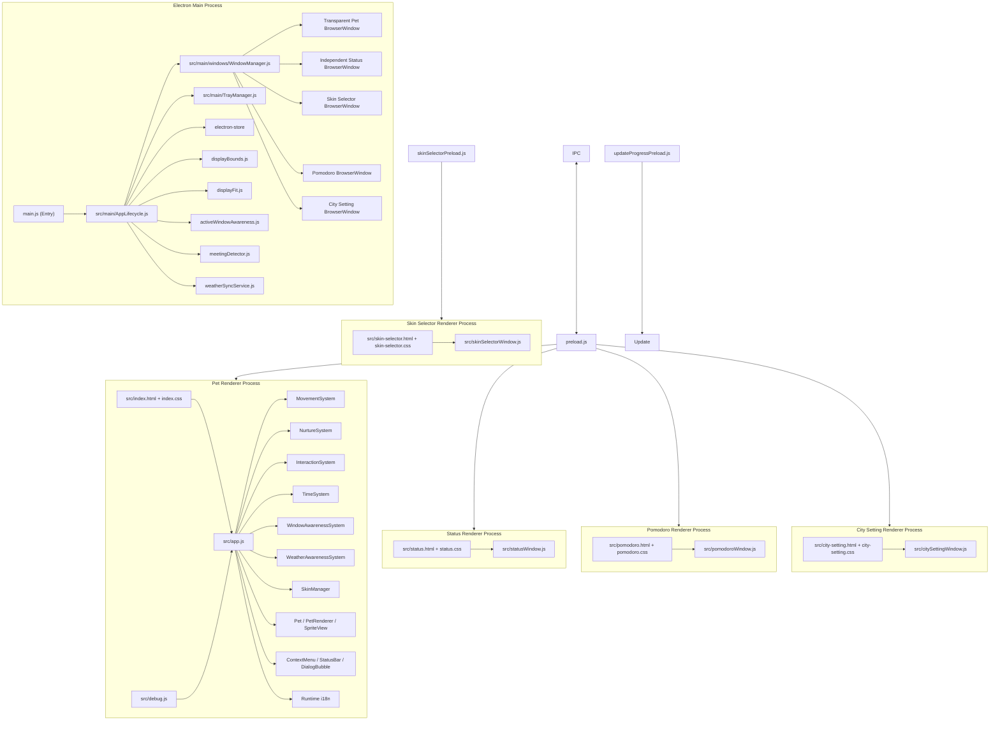

# DeskPet 项目结构与架构说明

本文档记录当前 DeskPet / qijiu-desktop-pet 的主要目录、运行时结构和关键机制，方便后续维护、调试和交接。更细的设计取舍请参考 [docs/decisions](./decisions/) 下的 ADR。

最后更新：2026-07-20

## 1. 架构总览

DeskPet 是一个 Electron 桌面宠物应用。主进程负责窗口、系统托盘、持久化、更新、跨屏边界、番茄钟和 IPC；渲染进程负责宠物状态、移动、交互、动画、UI 和状态窗口渲染。



## 2. 目录结构

```text
qijiu-desktop-pet/
|-- .agents/skills/desktop-pet-maintenance/SKILL.md  # 项目级维护与验证技能
├─ main.js                              # Electron 主进程极简入口：仅包含单实例锁与 QA 目录配置，调用 AppLifecycle.init()
├─ src/main/AppLifecycle.js             # 主进程生命周期托管：接管 ready / powerMonitor 事件，组装与初始化各子模块，集中处理 IPC
├─ src/main/DisplayService.js           # 多屏几何服务 init(deps) 模块：虚拟桌面边界、屏幕信息广播、窗口锁定/适配/跨屏迁移、拖拽轮询、活动窗口 bounds/displays 查询（与 displayFitScheduler 同归本模块以消除循环依赖）
├─ src/main/TrayManager.js              # 系统托盘管理：构建托盘菜单、处理中英文切换及各菜单项的点击交互
├─ src/main/windows/WindowManager.js    # 窗口实例中心：统一持有和管理所有 BrowserWindow (主窗口、状态窗、番茄钟、选肤窗等)
├─ src/main/windows/StatusWindow.js     # 独立状态窗口 init(deps) 模块：创建/显示/隐藏/更新/尺寸调整 + 对应 IPC，内部持有 lastStatusWindowData
├─ src/main/windows/UpdateProgressWindow.js # 更新进度窗口 init(deps) 模块：显示/更新进度/关闭，由 updateManager 的 updateProgressUi 接线调用
├─ src/main/services/SkinService.js     # 皮肤服务 init(deps) 模块：可用皮肤扫描与缓存、画廊数据、当前皮肤状态、选肤器请求鉴权、番茄钟素材解析、全部 8 个皮肤 IPC handler
├─ src/main/services/LocaleService.js   # 语言服务 init(deps) 模块：当前语言状态、启动时加载/自动检测、get-locale/set-locale IPC 及跨窗口 locale-changed 广播
├─ src/main/services/WindowAwarenessService.js # 活动窗口感知服务 init(deps) 模块：采样器生命周期、开关状态、get-active-window-info IPC，导出 getLastPayload() 供 presentationGuard 用
├─ src/main/services/PetVisibilityService.js # 桌宠可见性状态机 init(deps) 模块：manual/meeting/pomodoro 三来源合并与优先级仲裁、走动暂停状态、get-pet-visibility-state IPC；不直接引入 Electron 模块，electron 能力全部经 deps 注入，可被 node --test 直接单测
├─ src/main/services/MeetingDetectorController.js # 会议检测控制器 init(deps) 模块：meetingDetector 生命周期，deps 提供 PetVisibilityService 的 hidePetForMeeting/showPetAfterMeeting 回调
├─ src/main/services/PomodoroService.js # 番茄钟服务 init(deps) 模块：分钟数存取、皮肤素材缓存、tick 定时器、启停会话、状态快照与推送，deps 注入 SkinService/PetVisibilityService/pomodoroWindowModule/windowManager/trayManager/StoreManager
├─ src/main/services/WeatherSyncController.js # 天气同步控制器 init(deps) 模块：设置存取、周期同步定时器、store.onDidChange 订阅、get-city-settings/set-city-name IPC；勿与根目录 weatherSyncService.js（网络请求/清洗）混淆
├─ src/main/services/BreakReminderController.js # 久坐提醒控制器 init(deps) 模块：breakReminderService 生命周期、presentationGuard 接线、powerMonitor 四个事件、break-reminder-dismissed IPC，导出开关/间隔状态存取
├─ src/main/services/StorageIpc.js      # 存储 IPC 模块：electron-store key 安全白名单、save-data/load-data、set/get-auto-launch
├─ src/main/constants.js                # 跨模块共享的 electron-store key 常量（LOCALE_KEY、BREAK_REMINDER_STORE_KEY、POMODORO_LAST_MINUTES_KEY）
├─ preload.js                           # contextBridge 暴露 window.electronAPI，隔离渲染进程和主进程
├─ skinSelectorPreload.js               # 选肤窗专用最小 preload：画廊数据、预览/确定/取消、关闭与语言订阅
├─ skinGallery.js                        # 皮肤画廊纯数据构建：封面优先级(kiss.webp优先)、名称与画师字段解耦和当前项标记
├─ updateProgressPreload.js             # 更新进度窗口专用最小 preload，只暴露进度订阅 IPC
├─ updateManager.js                     # GitHub Releases / electron-updater 更新检查、下载进度、错误分级和 macOS 手动更新流程
├─ displayBounds.js                     # 多显示器虚拟桌面边界和可行走区域计算，纯逻辑模块
├─ displayFit.js                        # 显示器变化事件合并、窗口 bounds 适配和 min/max 约束桥接
├─ activeWindowProvider.js              # 活动窗口采样 provider 合同与 Windows 前台窗口读取实现
├─ activeWindowAwareness.js             # 活动窗口 bounds 到渲染进程 surface platform payload 的转换、去重与续期
├─ ipcContracts.js                      # IPC 输入归一化、校验和统一结果对象 helper
├─ breakReminderService.js              # 久坐提醒主进程计时服务：空闲采样、连续活跃时间累计、提醒触发
├─ presentationGuard.js                 # 提醒前置守卫：Windows 全屏/演示延后；macOS 始终放行
├─ meetingDetector.js                   # 会议自动隐藏检测：已知会议进程 + UDP 端点数量轮询与防抖状态机
├─ weatherSyncService.js                # 天气感知与时空同步服务主进程：网络请求、缓存、节流和降级
├─ package.json                         # npm 脚本、Electron Builder 配置、依赖声明
├─ package-lock.json                    # npm 锁文件
├─ CHANGELOG.md                         # 版本变更记录
├─ README.md / readme*.txt              # 用户说明与多语言说明文本
├─ push.sh / push.ps1                    # 推送前验证与 Git 推送辅助脚本
├─ build/
│  └─ installer.nsh                     # Windows NSIS 安装器定制脚本
├─ scripts/                             # 项目自动化脚本：npm 命令、打包发布钩子和维护检查
│  ├─ afterPack.js                      # Electron Builder 打包后处理
│  ├─ check_adrs.js                     # ADR 格式检查脚本
│  ├─ check_lang.py / check_lang2.py    # 文案语言检查辅助脚本
│  ├─ convert_images.js                 # 图片转换维护脚本
│  ├─ fix_adrs.js / fix_adrs.py         # ADR 标题格式修复脚本
│  ├─ generate_replacements.js          # ADR 标题替换片段生成脚本
│  ├─ set-win-icon.ps1                  # Windows 图标处理脚本
│  ├─ verify-installer.js               # 安装包结构校验
│  └─ verify-signatures.ps1             # 签名/可执行文件校验
├─ src/
│  ├─ index.html                        # 主宠物窗口 HTML
│  ├─ index.css                         # 主窗口样式、动画和 UI 布局
│  ├─ effects.css                       # 天气与粒子动效独立样式
│  ├─ context-menu.css                  # 右键菜单样式
│  ├─ dialog-bubble.css                 # 对话气泡样式
│  ├─ stat-bar.css                      # 状态进度条独立样式组件，供主窗口与状态窗口复用
│  ├─ app.js                            # 渲染进程编排：初始化、game loop、保存、皮肤切换、状态同步
│  ├─ debug.js                          # 开发调试入口：测试交互、屏幕信息等
│  ├─ status.html                       # 独立状态窗口 HTML
│  ├─ status.css                        # 独立状态窗口差异样式，复用 index.css 的 .xianxia-panel 基类
│  ├─ statusWindow.js                   # 独立状态窗口渲染和 i18n 更新
│  ├─ pomodoro.html                     # 独立番茄钟窗口 HTML
│  ├─ pomodoro.css                      # 番茄钟窗口差异样式，复用 .xianxia-panel 基类与设计令牌
│  ├─ pomodoroWindow.js                 # 番茄钟窗口渲染、输入、置顶切换和完成态
│  ├─ city-setting.html                 # 城市设置独立窗口 HTML
│  ├─ city-setting.css                  # 城市设置差异样式，复用 .xianxia-panel 基类与设计令牌
│  ├─ citySettingWindow.js              # 城市设置独立窗口渲染、输入验证与状态反馈
│  ├─ skin-selector.html                # 皮肤画廊独立窗口 HTML，严格 CSP 允许 pet-asset 图片
│  ├─ skin-selector.css                 # 皮肤画廊网格与修仙面板差异样式
│  ├─ skinSelectorWindow.js             # 皮肤画廊渲染、实时预览与确定/取消流程、画师名次级展示、键盘关闭与 i18n 更新
│  ├─ update-progress.html              # 更新进度窗口 HTML，使用严格 CSP 和外部资源
│  ├─ update-progress.css               # 更新进度窗口样式
│  ├─ update-progress.js                # 更新进度窗口渲染，通过 textContent 和样式属性更新进度
│  ├─ data/
│  │  ├─ config.js                      # 全局配置：数值、移动、交互、状态等
│  │  ├─ dialogues.js                   # 对话与交互文本
│  │  └─ i18n.js                        # zh / en / ja 多语言字典
│  ├─ pet/
│  │  ├─ Pet.js                         # 宠物实体状态：位置、方向、数值、动作状态
│  │  ├─ PetRenderer.js                 # 宠物 DOM 渲染、交互事件绑定、拖拽入口
│  │  └─ SpriteView.js                  # 基于状态的图片帧播放、预加载和切换稳定性处理
│  ├─ systems/
│  │  ├─ InteractionSystem.js           # 双人距离检测、CP 互动、冷却、互动效果
│  │  ├─ MovementSystem.js              # 移动目标、跨屏行走区域、边界 clamp 和暂停控制
│  │  ├─ NurtureSystem.js               # 饥饿、灵力、心情、好感等养成数值变化
│  │  ├─ PomodoroSystem.js              # 轻量番茄钟倒计时状态机，基于 endAt 推导剩余时间
│  │  ├─ SkinManager.js                 # 皮肤扫描结果应用、路径注入、回退逻辑
│  │  ├─ TimeSystem.js                  # 时间流逝、离线衰减、周期保存
│  │  ├─ WeatherAwarenessSystem.js      # 接收并应用主进程下发的天气和时段抽象 payload
│  │  └─ WindowAwarenessSystem.js       # 缓存活动窗口平台，供移动系统 O(1) 读取
│  ├─ ui/
│  │  ├─ ContextMenu.js                 # 渲染进程右键菜单
│  │  ├─ DialogBubble.js                # 对话气泡
│  │  ├─ StatusBar.js                   # 主窗口内嵌状态条
│  │  └─ WeatherParticleLayer.js        # 渲染层天气粒子效果生成与管理
│  └─ assets/
│     ├─ icon.ico / icon.icns / icon.png # 应用图标与托盘图标资源
│     ├─ default/                       # 默认皮肤：基础动作、互动动作、双角色行走帧
│     ├─ birds/                         # birds 皮肤：同一资源契约下的替换皮肤
│     ├─ animal_ears/                   # animal_ears 皮肤：兽耳角色皮肤
│     └─ school_au/                     # school_au 皮肤：校园 AU 角色皮肤
├─ test/
│  ├─ *.test.js                         # Node.js test runner 单元/集成测试
│  └─ 覆盖范围：多屏、移动、养成、皮肤、i18n、更新、状态保存、安全和打包校验
├─ tools/                               # 手动运行的本地工具：调试校准和素材处理，不属于打包自动流程
│  ├─ crop_sprite.py                    # 精灵图裁切工具
│  ├─ measure-meeting-udp.js            # 会议应用 UDP 端点观测脚本，用于校准检测阈值
│  ├─ run_trim.py                       # 批量按动画分组切除透明边距脚本
│  └─ trim_sprites.py                   # 精灵图透明边裁剪工具
└─ docs/
   ├─ structure.md                      # 本文档
   ├─ git-workflow.md                   # Git 提交和推送工作流
   ├─ release-workflow.md               # 发布流程
   ├─ release-code-signing.md           # 代码签名说明
   ├─ troubleshooting.txt               # 故障排查记录/草稿
   ├─ skin_assets_requirements.*        # 皮肤资源命名和尺寸要求
   ├─ decisions/                        # 架构决策记录 ADR
   ├─ plan/                             # 功能规划和任务拆分
   ├─ archive/                          # 已归档计划、交接、历史 review 和本地更新测试配置
   └─ source-assets/                    # 源素材备份，不随应用打包
```

## 3. 运行时关键机制

### 3.1 主进程职责

`main.js` 是应用的系统层入口，主要负责：

- 创建透明、无边框、可置顶的主宠物窗口。
- 创建独立状态窗口，并通过 IPC 接收渲染进程上报的数据。
- 创建独立番茄钟窗口，管理倒计时生命周期、置顶切换、上次时长偏好和桌面宠物的临时隐藏/恢复。
- 创建独立城市设置窗口，接收城市名输入，触发实时地名解析（Geocoding）及回传验证结果。
- 维护系统托盘菜单，包括显示/隐藏、恢复走动、重置位置、皮肤切换、语言切换、开机启动、检查更新和退出。
- 使用 `electron-store` 保存宠物状态、当前皮肤、语言、位置、开机启动偏好等数据。
- 使用 `app.requestSingleInstanceLock()` 保证单实例运行，并在二次启动时唤回已有窗口。
- 使用 `displayBounds.js` 计算多显示器虚拟桌面范围和每块屏幕的可行走区域。
- 使用 `displayFit.js` 合并显示器指标突发事件，并在重新适配透明主窗口时桥接 min/max 尺寸约束。
- 管理点击穿透：默认让窗口不阻挡桌面操作，在宠物、菜单或状态条悬停时恢复鼠标事件。
- 监听 `powerMonitor` 睡眠/唤醒事件，向渲染进程同步真实时间差（用于修复 macOS 睡眠期间时间冻结的问题）。
- 启动 `meetingDetector.js` 低频检测已知会议应用，在检测到 Teams/Zoom 等会议活动时自动隐藏桌宠，会议结束后恢复；手动隐藏状态和会议自动隐藏状态相互独立。
- 在退出前请求渲染进程做最后一次状态保存，降低异常退出造成的数据丢失。

### 3.2 渲染进程职责

`src/app.js` 编排宠物运行逻辑：

- 初始化两个宠物实体、渲染器、移动系统、养成系统、交互系统、时间系统和皮肤系统。
- 通过 `requestAnimationFrame` 驱动 game loop。
- 每帧按顺序处理移动、养成、互动、DOM 更新和 SpriteView 动画帧。
- 在游戏循环处理异常大的 `deltaMs` 或收到主进程的唤醒 IPC 时结算离线衰减，并限制物理 `deltaMs` 避免碰撞/飞出屏幕。
- 处理主进程广播的屏幕信息、语言变化、皮肤变化、显示/隐藏等事件。
- 定期保存状态，并在退出前执行 final save。

### 3.3 宠物实体与渲染

宠物相关代码分为三层：

- `Pet.js`：保存宠物状态，包括坐标、方向、当前动作、养成数值、拖拽/暂停等运行时状态。
- `PetRenderer.js`：创建和更新 DOM，处理拖拽、点击、菜单触发、状态条挂载和渲染层事件。
- `SpriteView.js`：根据宠物状态选择图片资源，预加载关键帧，并稳定处理帧切换，避免状态变化时出现空白或错帧。

### 3.4 移动与多显示器

多屏支持由主进程和渲染进程协作完成：

- `main.js` 读取 Electron `screen` 信息并设置主窗口覆盖虚拟桌面。
- `displayBounds.js` 将各显示器 `workArea` 转为相对主窗口的 `walkAreas`。
- `displayFit.js` 将 `display-added`、`display-removed` 和 `display-metrics-changed` 的短时间连发合并为一次窗口适配，避免 macOS 数位板驱动等场景下出现多次可见 resize。
- `MovementSystem` 根据 `walkAreas` 选择目标点、跨屏移动、边界修正和不可达区域回退。
- 当显示器布局、缩放或窗口位置变化时，主进程重新发送屏幕信息，渲染进程调用可达性修正逻辑把宠物拉回有效区域。

### 3.5 Surface Awareness

Surface Awareness 的窗口平台设计背景记录在 [ADR-030](./decisions/ADR-030-window-awareness.md)。

- `activeWindowProvider.js` 定义主进程的活动窗口采样接口。Windows 通过 PowerShell/User32 辅助逻辑读取前台窗口；macOS 和暂不支持的平台返回不可用兜底。
- `activeWindowAwareness.js` 将活动窗口 bounds 转成渲染进程相对坐标中的平台矩形，并在 IPC 发送前去重；主进程会按采样间隔刷新未变化 payload 的 `sampledAt`，避免 renderer 侧平台 TTL 在窗口长期不变时过期。
- `displayBounds.js` 负责平台几何换算，并和多显示器 walk area 换算保持在同一边界模块中；它还会从 `display.bounds` 和 `display.workArea` 推导底部横向任务栏平台。
- `preload.js` 只向渲染进程暴露安全的 `getActiveWindowInfo()` 和 `onActiveWindowInfo(callback)` API。
- `src/systems/WindowAwarenessSystem.js` 在渲染进程缓存最新 IPC payload，并为 game loop 提供 O(1) 的 `getCurrentPlatform()` 读取。
- `main.js` 通过 `screen-info` 将 `taskbarPlatforms` 发送给渲染进程（支持 Windows 和 macOS 底部 Dock），不经过活动窗口采样轮询。
- `MovementSystem` 通过 `setSurfacePlatforms()` 接收活动窗口平台和任务栏平台，只在 idle 宠物选择新目标时使用可达平台；窗口平台优先，任务栏平台低频出现。宠物走上活动窗口顶部或任务栏平台后，有较高概率（默认 70%）在下一次 idle 选点时继续沿着当前边缘行走。不可用、禁用、过期、最小化、最大化、全屏，以及平台附近宠物放不下的情况，都会回退到普通显示器 walk area。

### 3.6 养成系统

`NurtureSystem` 负责宠物的数值变化。当前核心数值包括：

- 好感：影响互动解锁和互动效果。
- 饥饿：随时间下降，喂食、互动和异常状态会改变它。
- 灵力：随时间下降，可通过修炼或互动恢复。
- 心情：受饥饿、灵力、交互和主动照顾影响。

`TimeSystem` 负责时间差计算和离线衰减。应用重启后会根据上次保存时间计算离线变化，并将结果应用到宠物数值。

### 3.7 双人互动

`InteractionSystem` 每帧检测两个宠物的距离。距离进入互动阈值后，根据好感、冷却时间和当前动作状态触发互动。

主要特点：

- 拖拽中不触发互动，避免误判。
- 互动动作会锁定双方动作状态，避免移动系统立即覆盖。
- 互动有全局冷却，防止短时间重复触发。
- 对话气泡由 `DialogBubble` 渲染，文本来自 `dialogues.js` 和 i18n 字典；普通气泡限制长英文宽度、允许换行，并在与现有普通气泡重叠时向上错开，避免 `greet` 等非 overlay 双宠互动重叠。

### 3.8 皮肤系统

皮肤目录遵循同一资源契约：

```text
src/assets/{skinId}/
├─ left.webp / right.webp
├─ left_sleep.webp / right_sleep.webp
├─ left_hungry.webp / right_hungry.webp
├─ left_eat.webp / right_eat.webp
├─ left_cultivate.webp / right_cultivate.webp
├─ left_pat.webp / right_pat.webp
├─ kiss.webp / hug.webp / cultivate.webp / shareFood.webp / throwup.webp
├─ yueqi/
│  └─ walk_left01.webp ... walk_right04.webp
└─ shenjiu/
   └─ walk_left01.webp ... walk_right04.webp
```

`main.js` 扫描 `src/assets/` 下的皮肤目录，托盘菜单发出皮肤切换事件；`SkinManager` 在渲染进程内应用皮肤路径并更新 `Pet`、`PetRenderer` 和 `SpriteView`。

### 3.9 多语言系统

多语言由 `src/data/i18n.js` 统一维护，目前包含中文、英文和日文。

- 主进程维护当前语言，并把托盘菜单、tooltip、更新弹窗等文本翻译到对应语言。
- 渲染进程通过 `window.t()` 和 `data-i18n` 刷新主窗口 UI。
- 独立状态窗口保存 `lastRenderData`，语言变化时可用当前状态重新渲染。
- 独立番茄钟窗口使用 `data-i18n` 和 `data-i18n-title` 刷新标题、按钮、完成台词和置顶按钮说明。
- `preload.js` 暴露 `getLocale`、`setLocale` 和 `onLocaleChange` 等 IPC API。

### 3.10 更新系统

`updateManager.js` 封装更新流程：

- Windows 主要走 `electron-updater` 和 GitHub Releases。
- macOS 包含手动更新提示和可执行文件名处理。
- 支持检查中、下载中、下载完成、无更新、错误等状态。
- 主进程会展示可见的更新进度窗口，并通过 `updateProgressPreload.js` 的最小 IPC 通道同步进度和托盘菜单状态。
- 404 或 release 元数据缺失会被归类为"已是最新/暂无更新"一类的可理解提示，而不是直接暴露底层错误。

### 3.11 久坐提醒

`breakReminderService.js` 负责久坐提醒的核心计时逻辑：

- 使用 `powerMonitor.getSystemIdleTime()` 低频采样（默认每 30 秒），不监听键盘/鼠标事件。
- 当连续活跃时间达到配置间隔（默认 60 分钟）时触发提醒。
- 用户空闲超过 `idleResetMinutes`（默认 5 分钟）时自动重置计时器。
- 系统锁屏/挂起/恢复事件也会重置计时器。
- 提醒触发前经过 `PresentationGuard` 检查：
  - macOS：始终允许提醒（不做全屏检测，避免请求辅助功能权限）。
  - Windows：检查前台窗口是否全屏或覆盖整个工作区，若是则延后 60 秒重试。
  - 不保存窗口标题、进程名或 URL。
- 渲染进程收到提醒后：两个小人瞬移到主显示器中心面对面站立，显示随机对话气泡，20 秒后自动消失或点击小人提前关闭。
- 配置通过 `electron-store` 持久化，托盘菜单提供开关和间隔（30/45/60/90/120 分钟）选择。

### 3.12 会议自动隐藏

`meetingDetector.js` 负责主进程侧会议状态检测，设计背景记录在 [ADR-035](./decisions/ADR-035-meeting-auto-hide.md)。

- Windows 优先使用 `tasklist /fo csv /nh` 获取当前已知会议应用 PID；若 `tasklist` 被权限策略拒绝，则回退到 `powershell.exe Get-Process` 仅查询已知会议应用进程名。随后用 `netstat -ano -p udp` 统计当次 PID 的 UDP 端点数量；若 `netstat` 被权限策略拒绝或返回失败，则将本次 UDP 状态标记为 unknown，让状态机保留当前会议隐藏状态并避免轮询日志刷屏。PID 只用于当次采样关联，不写死。
- macOS 使用 `pgrep -x` 和 `lsof -nP -i UDP -p <pid> -Fn` 做同类检测。
- 默认每 5 秒采样一次。当前 Windows Teams 实测基线为未开会 `0, 2`，会议/共享中 `0, 6`，MVP 阈值为任一同名进程 UDP `>= 5`，连续 2 次命中后判定会议中。
- 低于阈值持续 15 秒后判定会议结束，避免短暂网络波动导致桌宠闪现。
- `main.js` 使用独立的 `meetingHidden` 状态标记，与手动 `petHidden` 分离。用户通过托盘手动显示桌宠时会清除会议自动隐藏状态；用户手动隐藏的桌宠不会在会议结束后被自动显示。
- 检测边界仅限进程名和 UDP 端点数量，不读取会议标题、窗口标题、浏览器 URL、音视频内容或屏幕内容。
- `tools/measure-meeting-udp.js` 可用于后续校准 Zoom、Slack、Discord 或不同 Teams 版本的阈值。

### 3.13 轻量番茄钟

轻量番茄钟是本地陪伴型倒计时功能，不是监督型专注检测。设计计划记录在 [cangqiong-pomodoro-plan.md](./plan/cangqiong-pomodoro-plan.md)。

- `src/systems/PomodoroSystem.js` 是纯倒计时状态机，使用 `startedAt`、`durationMs` 和 `endAt` 推导 `remainingMs` 与 `progress`，避免依赖 interval 累计。
- `main.js` 拥有番茄钟窗口生命周期：托盘入口打开/聚焦窗口，IPC 负责开始、停止、关闭、读取状态和切换置顶。
- 窗口使用 `src/pomodoro.html`、`src/pomodoro.css` 和 `src/pomodoroWindow.js`，视觉上复用状态窗口和右键菜单的玉色玻璃系统。
- 分钟输入默认使用 `electron-store` 中的 `lastPomodoroMinutes`，首次使用或非法输入时回退到 25 分钟，并将单次时长限制在安全范围内。
- 专注开始时，主进程记录 `pomodoroFocusSnapshot.wasPaused`，设置独立的 `pomodoroPetHidden` 覆盖态，隐藏桌面宠物并暂停移动；完成、手动停止或关闭窗口后恢复到专注前的隐藏/暂停状态。
- 番茄钟窗口的生命周期管理（包括窗口状态 IPC 响应与专属置顶状态 `alwaysOnTop`）完全独立封装在 `src/main/windows/PomodoroWindow.js` 中。
- 番茄钟窗口内的宠物不是主窗口 DOM 迁移，而是根据当前皮肤显示素材：初始页使用 `left_cultivate.webp` / `right_cultivate.webp`，倒计时页使用 `cultivate.webp`，完成页使用 `kiss.webp`，缺失时回退到 `assets/default/`。
- 置顶状态只影响番茄钟窗口；主透明桌宠窗口仍沿用自己的置顶守卫策略。
- 隐私边界：番茄钟不检查前台窗口、不读取窗口标题、不读取浏览器 URL、不扫描进程、不记录用户使用的软件或网页。

### 3.14 天气感知与时空同步

`weatherSyncService.js` 与 `WeatherAwarenessSystem.js` 构成了桌宠的天气与本地时段感知系统，设计约束记录在 [ADR-038](./decisions/ADR-038-weather-sync.md)。

- **本地时段感知**：无需网络，根据本地系统时间计算五个阶段（`morning`, `day`, `dusk`, `evening`, `night`）。
- **无打扰休眠**：处于 `night`（00:00 - 04:59）且状态为 `idle` 时，宠物自动切换至睡觉动作，不触发消耗与养成惩罚；大幅降低夜间主动双人互动概率。
- **天气与地理服务**：默认关闭以保护隐私；开启后基于 Open-Meteo 免 Key 接口，通过 `weatherSyncService.js` 发起。在城市地名解析 (Geocoding) 时内置 `WELL_KNOWN_CITY_ALIASES` 词典预转国际大都市中英简称，并采用 `count=10` 多候选结合 `population` (常住人口) 降序择优；获取天气数据后在主进程清洗温度、WMO 天气代码、降水、雨量、阵雨、降雪、风速、风向和阵风字段。
- **城市设置独立 UI**：提供沙盒化的高颜值独立窗口（`citySettingWindow`）进行城市输入。用户输入后由主进程发起地名解析（Geocoding）并实时回传结果，避免直接暴露底层 `config.json`；窗口在打开、恢复或任务栏重新激活时会短暂提升层级并抬到前台，随后恢复普通窗口层级（见 [ADR-039](./decisions/ADR-039-city-setting-ui-window.md)）。
- **局部天气渲染**：渲染进程收到天气特征（如 `rain`, `snow`, `clear`, `windy`, `thunderstorm`, `heat`）和时段后，通过 `data-weather` 和 `data-time-phase` 保留状态语义；雨雪、大风、雷暴和高温使用 `WeatherParticleLayer` 在桌宠附近创建有上限的局部粒子组，雷暴表现为雨粒子叠加低频局部闪电（当主天气为 `thunderstorm` 时，系统与粒子层将 `windIntensity` 自动归一化为 `'none'`，不再叠加刮风风痕，避免画面要素过多变得杂乱），大风仅在非雷暴状态下表现为风痕粒子，炎热 (`heat`) 表现为自底向上升腾的清透白银阳炎折射流线与底座 (`top: 94%~100%`) 真实呼吸热辐射场，同时配合中英日三语 `weather_heat` 专属对话台词。动画交给 CSS `transform`，切换、隐藏或禁用时立即清理。天气效果不改变整屏亮度、对比度或饱和度。
- **静默降级策略**：遇到网络不通、DNS 无法解析或接口限流时，服务安静回退到纯本地时段模式；请求失败自动进入 TTL 退避；恢复休眠后不突发请求，绝不用错误弹窗打断用户的陪伴体验。

### 3.15 安全边界

当前安全边界以 Electron 推荐模式为基础：

- 渲染进程通过 `preload.js` 暴露的有限 API 访问主进程能力。
- 选肤窗不复用通用 `preload.js`；`skinSelectorPreload.js` 仅提供画廊数据、实时预览(`previewSkin`)、确定(`confirmSkin`)、取消(`cancelSkin`)、关闭和必要的语言订阅。主进程除校验皮肤 ID、维护预览期间的原皮肤快照并构造 `pet-asset:` 预览 URL 外，还会将所有选肤专属 IPC 的 `event.sender.id` 绑定到当前选肤窗口；其他 renderer 收到结构化 `FORBIDDEN` 结果。渲染层不接触文件系统路径（性能测评与多皮肤扩展优化储备见 `docs/decisions/ADR-041-skin-selector-performance-and-scaling.md`）。
- 主窗口、状态窗口、番茄钟窗口和更新进度窗口均启用 renderer `sandbox`，并不直接使用 Node 全局能力。
- HTML 注入相关逻辑有测试覆盖，更新进度窗口使用本地文件、严格 CSP、最小 preload IPC 和 `textContent` 渲染动态文案。
- IPC 通道集中在 `main.js`，便于审计。
- 新增或迁移后的 `ipcMain.handle` 优先使用 `ipcContracts.js` 中的 `{ success, data }` / `{ success, error }` 结果 helper；既有广覆盖接口在调用方完成兼容迁移前保持原返回形状。

## 4. 测试与验证

项目使用 Node.js 内置 test runner：

```bash
npm test
```

现有测试重点覆盖：

- `displayBounds.js` 多屏边界和可行走区域计算。
- `displayFit.js` 显示器事件合并、窗口 bounds 相等判断和 resize 约束桥接。
- `MovementSystem` 移动、暂停、边界和目标选择。
- `NurtureSystem` 和 `TimeSystem` 数值衰减、保存和离线变化。
- `SkinManager`、托盘皮肤扫描和渲染集成。
- `skinGallery.js` 的封面回退和画廊元数据契约，以及选肤窗 IPC 发件窗口授权、托盘入口和专用 preload。
- `PetRenderer`、`DialogBubble`、i18n fallback 和 HTML 注入防护。
- `updateManager.js` 更新状态、错误分类和菜单状态。

### 4.1 Playwright Electron QA

修改 Electron 窗口、渲染入口或桌面交互行为前后，优先运行隔离的冒烟检查：

```bash
npm run qa:electron:smoke
```

该命令通过 Playwright 启动 Electron，并同时使用临时 `--user-data-dir` 和 `DESKTOP_PET_USER_DATA_DIR`，确保 Chromium profile 与 `electron-store` 使用的应用 userData 都被隔离。它会确认主渲染进程和选肤页都已就绪，校验选肤页专用 preload、内置皮肤卡数量与当前皮肤标记，并在退出后清理临时 profile。自动化 QA 应使用该命令而不直接复用真实用户 profile，避免 profile lock、`DevToolsActivePort` 权限问题或真实 `config.json` 被测试实例覆盖。针对透明窗口右键菜单等视觉检查，先运行冒烟命令确认基础启动正常，再通过 Playwright 捕获目标窗口，检查对比度、裁切、间距和控制台错误。
- `breakReminderService.js` 计时、空闲重置、延后和配置归一化。
- `presentationGuard.js` 跨平台全屏检测和隐私边界。
- `meetingDetector.js` 会议进程 UDP 端点解析、防抖开始/结束和重复事件抑制。
- `PomodoroSystem`、番茄钟窗口结构、preload API、托盘入口和宠物隐藏/恢复边界。
- `ipcContracts.js` IPC 参数归一化、皮肤 ID 白名单和统一结果对象；`protectedAssetLoader` 的正向/负向 manifest 缓存，其中负向缓存测试会隔离默认受保护资源清单的存在状态。
- 打包相关的 macOS、安装器、签名和内存预算约束。
- `test/helpers/sourceCorpus.js` 提供统一的主进程测试源码读取入口：`readMainProcessSource()` 递归拼接 `main.js` 与 `src/main/` 下全部 `.js` 文件（按路径确定性排序），`read(relativePath)` 读取仓库根下的单个文件。所有原先手写 `main.js + AppLifecycle.js + TrayManager.js` 做字符串/正则断言的主进程测试统一改用该 helper，使断言与被断言逻辑的具体文件位置解耦，后续 `AppLifecycle.js`/`src/app.js` 巨石文件拆分（见 ADR-042）搬迁代码时无需逐个更新这些测试的文件路径。

## 5. 架构决策索引

主要 ADR：

- [ADR-001](./decisions/ADR-001-use-electron-framework.md)：使用 Electron 框架。
- [ADR-002](./decisions/ADR-002-mouse-clickthrough-strategy.md)：鼠标点击穿透策略。
- [ADR-004](./decisions/ADR-004-drag-implementation.md)：拖拽实现。
- [ADR-005](./decisions/ADR-005-gameloop-crash-protection.md)：game loop 崩溃保护。
- [ADR-006](./decisions/ADR-006-state-persistence-and-offline-decay.md)：状态持久化和离线衰减。
- [ADR-012](./decisions/ADR-012-render-performance-optimization.md)：渲染性能优化。
- [ADR-014](./decisions/ADR-014-electron-security-hardening.md)：Electron 安全加固。
- [ADR-017](./decisions/ADR-017-migrate-to-spriteview.md)：迁移到 SpriteView。
- [ADR-019](./decisions/ADR-019-handling-time-jumps-after-system-sleep.md)：系统睡眠后的时间跳变处理。
- [ADR-020](./decisions/ADR-020-windows-release-and-code-signing.md)：Windows 发布与签名。
- [ADR-021](./decisions/ADR-021-single-instance-launch-lock.md)：单实例启动锁。
- [ADR-022](./decisions/ADR-022-multi-display-support-boundary.md)：多显示器边界。
- [ADR-023](./decisions/ADR-023-stabilize-sprite-frame-transition.md)：精灵帧切换稳定性。
- [ADR-024](./decisions/ADR-024-i18n-multilingual-support.md)：多语言支持。
- [ADR-025](./decisions/ADR-025-visible-update-progress-and-local-update-testing.md)：可见更新进度和本地更新测试。
- [ADR-026](./decisions/ADR-026-macos-manual-update-executable-name.md)：macOS 手动更新可执行文件名。
- [ADR-027](./decisions/ADR-027-status-window-width-growth-fix.md)：状态窗口宽度增长修复。
- [ADR-028](./decisions/ADR-028-coalesce-display-metrics-window-fit.md)：合并显示器指标事件后再适配桌宠窗口。
- [ADR-029](./decisions/ADR-029-security-audit-and-local-hardening.md)：安全审计与本地硬化。
- [ADR-030](./decisions/ADR-030-window-awareness.md)：窗口感知平台采样。
- [ADR-031](./decisions/ADR-031-break-reminder.md)：久坐提醒设计。
- [ADR-032](./decisions/ADR-032-ipc-result-shape.md)：IPC 返回形状统一。
- [ADR-033](./decisions/ADR-033-frontend-ui-engineering-and-color-swap.md)：前端组件化、Design Tokens 与角色主题色互换。
- [ADR-034](./decisions/ADR-034-ui-performance-and-visual-upgrades.md)：UI 性能优化与高级视觉升级。
- [ADR-035](./decisions/ADR-035-meeting-auto-hide.md)：会议自动隐藏检测。
- [ADR-036](./decisions/ADR-036-cp-interaction-anti-overlap.md)：CP 互动防交叠机制。
- [ADR-037](./decisions/ADR-037-lightweight-pomodoro-companion.md)：轻量番茄钟陪伴模式。
- [ADR-038](./decisions/ADR-038-weather-sync.md)：天气感知与时空同步系统架构与隐私边界。
- [ADR-039](./decisions/ADR-039-city-setting-ui-window.md)：城市设置 UI 独立窗口与配置隔离。

## 6. 维护提示

- 遵循 `AGENTS.md` 与 `.geminirules` 的工程规范：多步骤重构或修复任务 (`/goal`) 必须遵循“改一题 -> 跑回归 -> 更新对应文档”的闭环验证链路，禁止无测试批量攒改。
- 新增或调整跨系统平台行为（如窗口置顶、多桌面切换、休眠唤醒时间计算等）时，务必考虑 macOS Space 隔离与 Dark Wake 时间突增校验逻辑。
- 新增跨模块行为时，优先更新对应 ADR 或在 `docs/plan/` 留下计划。
- 新增或更新皮肤时，严格遵守 `docs/skin-pipeline-guide.md`，同步维护 `skinGallery.js`、`protectedAssetLoader.js` 与中/英/日三语 README。
- 新增 IPC 时，同步检查 `preload.js` 暴露面、主进程 handler 权限校验和测试覆盖。
- 修改 game loop、移动、多屏或保存逻辑后，至少运行 `npm test`。
- 修改发布、更新或打包逻辑后，额外运行 `npm run verify:installer` 和需要的平台签名校验。
- `.codex/tmp-*` 与 `.agents/`、`security-scans/` 属于开发辅助与扫描临时产物，禁止作为源码提交。

## 受保护皮肤资产

- `scripts/protect-assets.js` 从 `src/assets/{skinId}/**/*.webp` 生成 `protected-assets/manifest.json` 和加密后的 `protected-assets/*.dat`。
- `protectedAssetLoader.js` 校验 `skin/{skinId}/...webp` manifest 资源 ID，在主进程中解密 AES-256-GCM 数据，并校验 size 与 SHA-256 完整性。
- `protectedAssetLoader.js` 对已解密资源使用有大小上限的内存 LRU 缓存，并对 manifest 结果及缺失检查 (`manifestNotFound`) 实施全内存缓冲，避免运行期或番茄钟心跳触发重复读盘和解密。
- `protectedAssetProtocol.js` 注册 Electron 异步 `pet-asset://skin/...` 协议处理器，配合 `loadProtectedAssetAsync` 的异步读盘与在途请求 (`inFlightLoads`) 去重机制，支持 `SkinManager`、`SpriteView`、`PetRenderer` 与番茄钟窗口无阻塞高效加载运行时皮肤图片。渲染进程切换皮肤时并发预加载两宠与双修/亲亲覆盖层贴图，并严格清理 `Image` 预加载对象的 DOM 事件监听器以防内存残留。
- renderer 运行时代码应使用 `pet-asset://skin/...` URL 加载皮肤 WebP，不能直接使用 Node 文件系统 API。源素材仍保留在 `src/assets/` 便于编辑；打包产物排除明文皮肤 WebP，并包含 `protected-assets/`。
- 架构决策见 `docs/decisions/ADR-040-encrypted-skin-assets.md`。
