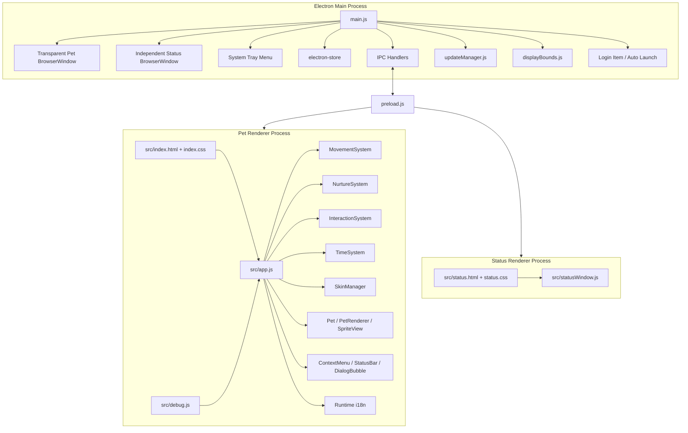

# DeskPet 项目结构与架构说明

本文档记录当前 DeskPet / qijiu-desktop-pet 的主要目录、运行时结构和关键机制，方便后续维护、调试和交接。更细的设计取舍请参考 [docs/decisions](./decisions/) 下的 ADR。

最后更新：2026-05-26

## 1. 架构总览

DeskPet 是一个 Electron 桌面宠物应用。主进程负责窗口、系统托盘、持久化、更新、跨屏边界和 IPC；渲染进程负责宠物状态、移动、交互、动画、UI 和状态窗口渲染。



## 2. 目录结构

```text
qijiu-desktop-pet/
├─ main.js                              # Electron 主进程入口：窗口、托盘、IPC、单实例、开机启动、置顶、状态窗口
├─ preload.js                           # contextBridge 暴露 window.electronAPI，隔离渲染进程和主进程
├─ updateManager.js                     # GitHub Releases / electron-updater 更新检查、下载进度、错误分级和 macOS 手动更新流程
├─ displayBounds.js                     # 多显示器虚拟桌面边界和可行走区域计算，纯逻辑模块
├─ package.json                         # npm 脚本、Electron Builder 配置、依赖声明
├─ package-lock.json                    # npm 锁文件
├─ CHANGELOG.md                         # 版本变更记录
├─ README.md / readme*.txt              # 用户说明与多语言说明文本
├─ build/
│  └─ installer.nsh                     # Windows NSIS 安装器定制脚本
├─ scripts/
│  ├─ afterPack.js                      # 打包后处理
│  ├─ convert_images.js                 # 图片转换辅助脚本
│  ├─ set-win-icon.ps1                  # Windows 图标处理脚本
│  ├─ verify-installer.js               # 安装包结构校验
│  └─ verify-signatures.ps1             # 签名/可执行文件校验
├─ src/
│  ├─ index.html                        # 主宠物窗口 HTML
│  ├─ index.css                         # 主窗口样式、动画和 UI 布局
│  ├─ app.js                            # 渲染进程编排：初始化、game loop、保存、皮肤切换、状态同步
│  ├─ debug.js                          # 开发调试入口：测试交互、屏幕信息等
│  ├─ status.html                       # 独立状态窗口 HTML
│  ├─ status.css                        # 独立状态窗口样式
│  ├─ statusWindow.js                   # 独立状态窗口渲染和 i18n 更新
│  ├─ data/
│  │  ├─ config.js                      # 全局配置：数值、移动、交互、状态等
│  │  ├─ dialogues.js                   # 对话与交互文本
│  │  └─ i18n.js                        # zh / en / ja 多语言字典
│  ├─ pet/
│  │  ├─ Pet.js                         # 宠物实体状态：位置、方向、数值、动作状态
│  │  ├─ PetRenderer.js                 # 宠物 DOM 渲染、交互事件绑定、拖拽入口
│  │  └─ SpriteView.js                  # 基于状态的图片帧播放、预加载和切换稳定性处理
│  ├─ systems/
│  │  ├─ InteractionSystem.js           # 双人距离检测、CP 互动、冷却、互动效果
│  │  ├─ MovementSystem.js              # 移动目标、跨屏行走区域、边界 clamp 和暂停控制
│  │  ├─ NurtureSystem.js               # 饥饿、灵力、心情、好感等养成数值变化
│  │  ├─ SkinManager.js                 # 皮肤扫描结果应用、路径注入、回退逻辑
│  │  └─ TimeSystem.js                  # 时间流逝、离线衰减、周期保存
│  ├─ ui/
│  │  ├─ ContextMenu.js                 # 渲染进程右键菜单
│  │  ├─ DialogBubble.js                # 对话气泡
│  │  └─ StatusBar.js                   # 主窗口内嵌状态条
│  └─ assets/
│     ├─ icon.ico / icon.icns / icon.png # 应用图标与托盘图标资源
│     ├─ default/                       # 默认皮肤：基础动作、互动动作、双角色行走帧
│     └─ birds/                         # birds 皮肤：同一资源契约下的替换皮肤
├─ test/
│  ├─ *.test.js                         # Node.js test runner 单元/集成测试
│  └─ 覆盖范围：多屏、移动、养成、皮肤、i18n、更新、状态保存、安全和打包校验
├─ tools/
│  ├─ crop_sprite.py                    # 精灵图裁切工具
│  └─ trim_sprites.py                   # 精灵图透明边裁剪工具
└─ docs/
   ├─ structure.md                      # 本文档
   ├─ git-workflow.md                   # Git 提交和推送工作流
   ├─ release-workflow.md               # 发布流程
   ├─ release-code-signing.md           # 代码签名说明
   ├─ troubleshooting.txt               # 故障排查记录/草稿
   ├─ skin_assets_requirements.*        # 皮肤资源命名和尺寸要求
   ├─ decisions/                        # 架构决策记录 ADR
   ├─ plan/                             # 功能规划和任务拆分
   ├─ archive/                          # 已归档计划、交接和历史 review
   └─ source-assets/                    # 源素材备份，不随应用打包
```

## 3. 运行时关键机制

### 3.1 主进程职责

`main.js` 是应用的系统层入口，主要负责：

- 创建透明、无边框、可置顶的主宠物窗口。
- 创建独立状态窗口，并通过 IPC 接收渲染进程上报的数据。
- 维护系统托盘菜单，包括显示/隐藏、恢复走动、重置位置、皮肤切换、语言切换、开机启动、检查更新和退出。
- 使用 `electron-store` 保存宠物状态、当前皮肤、语言、位置、开机启动偏好等数据。
- 使用 `app.requestSingleInstanceLock()` 保证单实例运行，并在二次启动时唤回已有窗口。
- 使用 `displayBounds.js` 计算多显示器虚拟桌面范围和每块屏幕的可行走区域。
- 管理点击穿透：默认让窗口不阻挡桌面操作，在宠物、菜单或状态条悬停时恢复鼠标事件。
- 在退出前请求渲染进程做最后一次状态保存，降低异常退出造成的数据丢失。

### 3.2 渲染进程职责

`src/app.js` 编排宠物运行逻辑：

- 初始化两个宠物实体、渲染器、移动系统、养成系统、交互系统、时间系统和皮肤系统。
- 通过 `requestAnimationFrame` 驱动 game loop。
- 每帧按顺序处理移动、养成、互动、DOM 更新和 SpriteView 动画帧。
- 在系统睡眠/唤醒或长时间暂停后限制异常 `deltaMs`，避免数值和物理状态被一次性冲坏。
- 处理主进程广播的屏幕信息、语言变化、皮肤变化、显示/隐藏等事件。
- 定期保存状态，并在退出前执行 final save。

### 3.3 宠物实体与渲染

宠物相关代码分为三层：

- `Pet.js`：保存宠物状态，包括坐标、方向、当前动作、养成数值、拖拽/暂停等运行时状态。
- `PetRenderer.js`：创建和更新 DOM，处理拖拽、点击、菜单触发、状态条挂载和渲染层事件。
- `SpriteView.js`：根据宠物状态选择图片资源，预加载关键帧，并稳定处理帧切换，避免状态变化时出现空白或错帧。

### 3.4 移动与多显示器

多屏支持由主进程和渲染进程协作完成：

- `main.js` 读取 Electron `screen` 信息并设置主窗口覆盖虚拟桌面。
- `displayBounds.js` 将各显示器 `workArea` 转为相对主窗口的 `walkAreas`。
- `MovementSystem` 根据 `walkAreas` 选择目标点、跨屏移动、边界修正和不可达区域回退。
- 当显示器布局、缩放或窗口位置变化时，主进程重新发送屏幕信息，渲染进程调用可达性修正逻辑把宠物拉回有效区域。

### 3.5 养成系统

`NurtureSystem` 负责宠物的数值变化。当前核心数值包括：

- 好感：影响互动解锁和互动效果。
- 饥饿：随时间下降，喂食、互动和异常状态会改变它。
- 灵力：随时间下降，可通过修炼或互动恢复。
- 心情：受饥饿、灵力、交互和主动照顾影响。

`TimeSystem` 负责时间差计算和离线衰减。应用重启后会根据上次保存时间计算离线变化，并将结果应用到宠物数值。

### 3.6 双人互动

`InteractionSystem` 每帧检测两个宠物的距离。距离进入互动阈值后，根据好感、冷却时间和当前动作状态触发互动。

主要特点：

- 拖拽中不触发互动，避免误判。
- 互动动作会锁定双方动作状态，避免移动系统立即覆盖。
- 互动有全局冷却，防止短时间重复触发。
- 对话气泡由 `DialogBubble` 渲染，文本来自 `dialogues.js` 和 i18n 字典。

### 3.7 皮肤系统

皮肤目录遵循同一资源契约：

```text
src/assets/{skinId}/
├─ left.webp / right.webp
├─ left_sleep.webp / right_sleep.webp
├─ left_hungry.webp / right_hungry.webp
├─ left_eat.webp / right_eat.webp
├─ left_cultivate.webp / right_cultivate.webp
├─ kiss.webp / hug.webp / cultivate.webp / shareFood.webp / throwup.webp
├─ yueqi/
│  └─ walk_left01.webp ... walk_right04.webp
└─ shenjiu/
   └─ walk_left01.webp ... walk_right04.webp
```

`main.js` 扫描 `src/assets/` 下的皮肤目录，托盘菜单发出皮肤切换事件；`SkinManager` 在渲染进程内应用皮肤路径并更新 `Pet`、`PetRenderer` 和 `SpriteView`。

### 3.8 多语言系统

多语言由 `src/data/i18n.js` 统一维护，目前包含中文、英文和日文。

- 主进程维护当前语言，并把托盘菜单、tooltip、更新弹窗等文本翻译到对应语言。
- 渲染进程通过 `window.t()` 和 `data-i18n` 刷新主窗口 UI。
- 独立状态窗口保存 `lastRenderData`，语言变化时可用当前状态重新渲染。
- `preload.js` 暴露 `getLocale`、`setLocale` 和 `onLocaleChange` 等 IPC API。

### 3.9 更新系统

`updateManager.js` 封装更新流程：

- Windows 主要走 `electron-updater` 和 GitHub Releases。
- macOS 包含手动更新提示和可执行文件名处理。
- 支持检查中、下载中、下载完成、无更新、错误等状态。
- 主进程会展示可见的更新进度窗口，并同步托盘菜单状态。
- 404 或 release 元数据缺失会被归类为“已是最新/暂无更新”一类的可理解提示，而不是直接暴露底层错误。

### 3.10 安全边界

当前安全边界以 Electron 推荐模式为基础：

- 渲染进程通过 `preload.js` 暴露的有限 API 访问主进程能力。
- 主窗口不直接使用 Node 全局能力。
- HTML 注入相关逻辑有测试覆盖，更新进度窗口会对动态内容进行转义。
- IPC 通道集中在 `main.js`，便于审计。

## 4. 测试与验证

项目使用 Node.js 内置 test runner：

```bash
npm test
```

现有测试重点覆盖：

- `displayBounds.js` 多屏边界和可行走区域计算。
- `MovementSystem` 移动、暂停、边界和目标选择。
- `NurtureSystem` 和 `TimeSystem` 数值衰减、保存和离线变化。
- `SkinManager`、托盘皮肤扫描和渲染集成。
- `PetRenderer`、`DialogBubble`、i18n fallback 和 HTML 注入防护。
- `updateManager.js` 更新状态、错误分类和菜单状态。
- 打包相关的 macOS、安装器、签名和内存预算约束。

## 5. 架构决策索引

主要 ADR：

- [ADR-001](./decisions/ADR-001-use-electron-framework.md)：使用 Electron 框架。
- [ADR-002](./decisions/ADR-002-mouse-clickthrough-strategy.md)：鼠标点击穿透策略。
- [ADR-004](./decisions/ADR-004-drag-implementation.md)：拖拽实现。
- [ADR-005](./decisions/ADR-005-gameloop-crash-protection.md)：game loop 崩溃保护。
- [ADR-006](./decisions/ADR-006-state-persistence-and-offline-decay.md)：状态持久化和离线衰减。
- [ADR-012](./decisions/ADR-012-render-performance-optimization.md)：渲染性能优化。
- [ADR-014](./decisions/ADR-014-electron-security-hardening.md)：Electron 安全加固。
- [ADR-017](./decisions/ADR-017-migrate-to-spriteview.md)：迁移到 SpriteView。
- [ADR-019](./decisions/ADR-019-handling-time-jumps-after-system-sleep.md)：系统睡眠后的时间跳变处理。
- [ADR-020](./decisions/ADR-020-windows-release-and-code-signing.md)：Windows 发布与签名。
- [ADR-021](./decisions/ADR-021-single-instance-launch-lock.md)：单实例启动锁。
- [ADR-022](./decisions/ADR-022-multi-display-support-boundary.md)：多显示器边界。
- [ADR-023](./decisions/ADR-023-stabilize-sprite-frame-transition.md)：精灵帧切换稳定性。
- [ADR-024](./decisions/ADR-024-i18n-multilingual-support.md)：多语言支持。
- [ADR-025](./decisions/ADR-025-visible-update-progress-and-local-update-testing.md)：可见更新进度和本地更新测试。
- [ADR-026](./decisions/ADR-026-macos-manual-update-executable-name.md)：macOS 手动更新可执行文件名。

## 6. 维护提示

- 新增跨模块行为时，优先更新对应 ADR 或在 `docs/plan/` 留下计划。
- 新增皮肤时，保持 `src/assets/{skinId}` 的文件命名契约，并运行资源尺寸测试。
- 新增 IPC 时，同步检查 `preload.js` 暴露面、主进程 handler 和测试覆盖。
- 修改 game loop、移动、多屏或保存逻辑后，至少运行 `npm test`。
- 修改发布、更新或打包逻辑后，额外运行 `npm run verify:installer` 和需要的平台签名校验。
